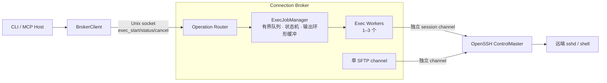
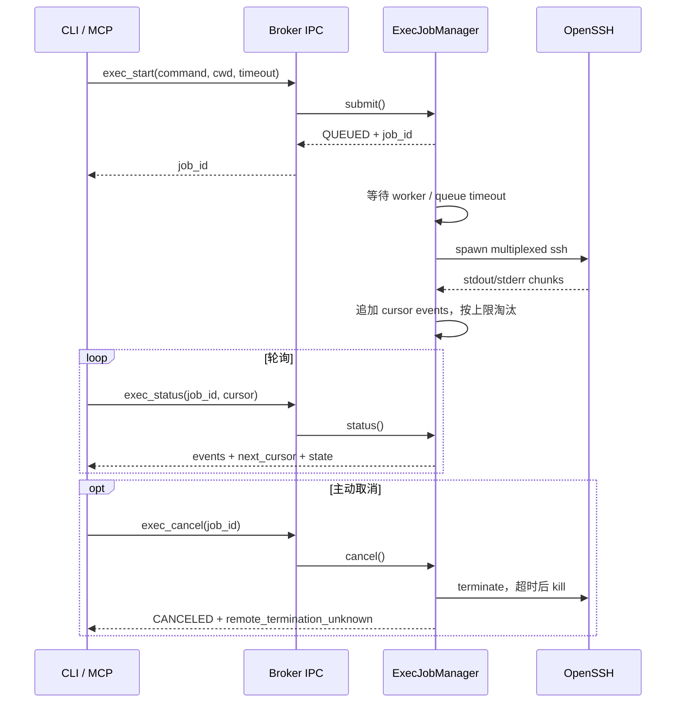
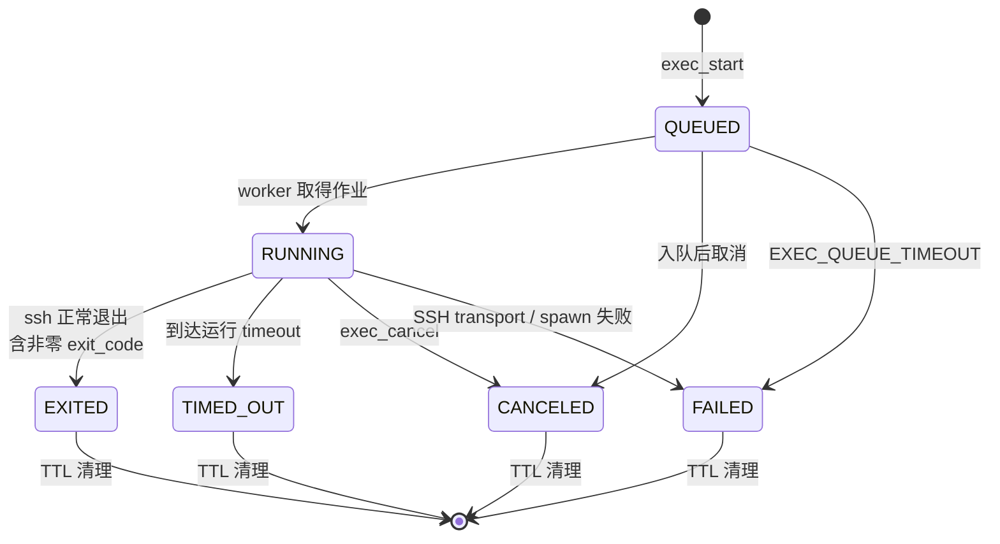

# 长命令异步任务 MVP 实施计划

## Summary

在 Connection Broker 内新增内存态长命令任务管理模块，使调用方可以启动远端命令、
按 cursor 增量读取 stdout/stderr、查询结构化状态和主动取消。

本期保留现有同步 `exec(command, cwd, timeout)`，并让 broker 模式下的同步与异步命令
共用同一个队列、并发限制、OpenSSH process 管理和输出上限。文件操作继续使用独立的
顺序 SFTP channel；长命令不得持有 `sftp_lock`，也不得增加 ControlMaster TCP 数量。

新增 Broker operation：

```text
exec_start(command, cwd="/", timeout=None)
exec_status(job_id, cursor=0, max_bytes=65536)
exec_cancel(job_id)
```

新增 CLI：

```text
remote exec-start [--cwd PATH] [--timeout SEC] -- COMMAND...
remote exec-status JOB_ID [--cursor N] [--max-bytes N]
remote exec-cancel JOB_ID
```

MCP MVP 合并后同步增加 `exec_start`、`exec_status`、`exec_cancel` 三个 tools。首期使用
轮询，不增加订阅 socket、SSE 或长期占用的 IPC response。

取消运行中命令时只保证终止本地 OpenSSH process/channel。由于远端只保证存在 shell，
不要求 `setsid`、Python、daemon 或其他 helper，因此结果必须返回
`remote_termination_unknown=true`，不得宣称远端进程已终止。

本期不实现：

- 作业跨 Broker 重启持久化。
- 可靠远端 PID/process group 终止。
- stdout/stderr 订阅推送。
- Web Explorer 或 macOS Desktop 终端界面。
- Windows named pipe Broker。
- 远端安装或上传可执行 helper。

### 目标架构



### 调用时序



### 作业状态



## Current State Analysis

### Repository State

- 当前分支：`feat/long-running-commands`。
- 当前 HEAD 与 `main`：`2485294`。
- MCP MVP 的设计、runtime、tests 和正式文档均已提交并合并。
- 当前另有未跟踪的并行 rsync 计划：
  - `.trae/documents/rsync-batch-transfer-mvp-implementation-plan.md`
- MCP runtime 采用 `_McpBrokerAdapter`、11 个 tools、1 MiB result limit 和
  `asyncio.to_thread()` Broker 调用；长命令实现应扩展这些已形成的 seam。
- 上述 rsync 计划属于正在进行的并行工作。本次规划只新增本文档，不修改、覆盖、删除
  或提交它。
- 长命令分支已从包含 MCP MVP 的最新 `main` 创建。

### Current Exec Runtime

`sshbridge/exec_client.py::run_exec` 使用：

```python
subprocess.run(argv, capture_output=True, timeout=timeout)
```

其行为：

- 调用线程等待命令结束。
- stdout/stderr 在内存中无上限累积。
- timeout 终止本地 ssh process，但远端进程状态未知。
- Broker 调用时传入 `connect_retries=0`，不会在命令可能已开始后重试。

`sshbridge/ops.py::op_exec` 已保持传输层无关：

- 校验 command 非空。
- 将虚拟 `cwd` 映射为远端起始目录。
- 接受可注入 `exec_runner`。
- 返回 JSON-ready 的 exit code、stdout、stderr、timeout 状态。

该 interface 保留；Broker 将注入 `ExecJobManager.run_sync`，direct 诊断模式继续使用
`run_exec`。

### Current Broker Concurrency

`sshbridge/broker.py::BrokerState` 当前拥有：

```python
self.exec_semaphore = threading.BoundedSemaphore(self.exec_limit)
self.sftp_lock = threading.Lock()
```

`_execute` 在 semaphore 满时无限等待，只有 `queued_exec` 计数：

- 没有队列长度上限。
- 没有排队 timeout。
- 没有 job ID 或可取消句柄。
- 调用该操作的 Broker client handler 线程在整个命令期间保持 Unix socket。
- `run_exec` 完成前不能返回增量输出。

已验证的正确行为必须保留：

- ControlMaster 可用时默认两个 Exec 并行。
- 第三个 Exec 排队且不创建新 TCP。
- Exec 不持有 `sftp_lock`，长命令期间 `list_dir` 仍可完成。
- 无 ControlMaster 时 Exec 并发降为 1，并受 `min_connect_interval` 约束。
- SSH transport failure 进入现有 `OPEN` 熔断状态，不自动重连。

### Current Broker IPC

- Unix socket 一请求一连接。
- 每个请求由独立 daemon thread 处理。
- 请求和响应为 newline-delimited JSON。
- envelope 包含 protocol version、request ID、profile fingerprint 和 instance ID。
- 单消息最大 `256 MiB`。
- socket 与 metadata 权限及 peer UID 校验已实现。

异步任务不改变 envelope，不需要保持一个 IPC connection 推送日志。每次 status 轮询
创建一个短连接。

### MCP Dependency

当前已提交的 MCP MVP runtime 已经：

- 使用 `sshbridge.mcp_server::_McpBrokerAdapter` 调用 `BrokerClient`。
- 暴露同步 `exec`。
- 将 MCP 单结果限制为 `1 MiB`。
- 使用 Python 3.12 的隔离 MCP SDK 环境。

长命令实现直接扩展已合并的 Adapter，不得创建第二个 Broker client 封装或复制
Tool error 转换。

## Proposed Changes

### 1. 建立实施分支与提交边界

前置条件：

1. 完成并合并 `feat/mcp-server`。
2. 确认 `main` 包含实际 `sshbridge/mcp_server.py` 与
   `tests/test_mcp_server.py`。
3. 保留并行 rsync 计划或其他用户工作区变更，不纳入本任务。

从更新后的 `main` 创建：

```text
feat/long-running-commands
```

计划提交：

1. `docs: finalize long-running command plan`
   - 本计划。
   - `draft.docs/07-long-running-commands.md` 的实施前状态校正。
2. `feat: add broker exec jobs`
   - process 启动 primitive、job manager、Broker operations、配置。
3. `feat: expose async exec clients`
   - CLI 与 MCP tools。
4. `test: verify long-running exec jobs`
   - 单元、Broker 协议、CLI/MCP 与真实 OpenSSH 集成测试。
5. `docs: document async exec jobs`
   - README、AGENTS、草案状态和实现提交链接。

不得提交：

- `.venv/`、build/dist、`.app`。
- Broker socket、metadata、ControlPath、日志。
- `bridge.json`、SSH key、known_hosts 或 Host 配置。
- 测试运行生成的临时 job/output 文件。
- 无关 rsync 计划或其他用户修改。

### 2. 新增底层 OpenSSH Process Primitive

修改 `sshbridge/exec_client.py`。

新增：

```python
build_exec_argv(profile, command, cwd) -> list[str]
start_exec(profile, command, cwd) -> subprocess.Popen
```

`build_exec_argv`：

- 保留现有 `cd <quoted-cwd> && <raw-command>` 语义。
- `cwd` 仍只是起始目录，不是命令沙箱。
- 使用 `Profile.exec_argv`，继续复用 OpenSSH config、Agent、ProxyJump、
  known_hosts 和 ControlPath。

`start_exec`：

- 使用 `subprocess.Popen`。
- `stdin=subprocess.DEVNULL`。
- `stdout=subprocess.PIPE`。
- `stderr=subprocess.PIPE`。
- `bufsize=0`，由 job manager 按固定 chunk 读取。
- 不使用 shell 执行本地 argv。
- `FileNotFoundError` 转换为 `SSH_ERROR`。
- Broker 调用路径不执行自动重试。

现有 `run_exec`：

- 保留给 direct 诊断模式和现有调用方。
- 复用 `build_exec_argv`，避免远端命令包装出现两套实现。
- 保持当前返回 shape。
- 不在该函数中实现任务 registry、队列或 cursor。

### 3. 复用 Exec 参数语义

修改 `sshbridge/ops.py`。

抽取：

```python
normalize_exec_request(profile, command, cwd="/", timeout=None) -> dict
```

返回内部 JSON-ready 数据：

```json
{
  "command": "make test",
  "cwd": "/src",
  "real_cwd": "/remote/root/src",
  "timeout": 3600
}
```

规则：

- command 必须为非空字符串。
- timeout 缺省为 `profile.exec_timeout`，且必须为正数。
- cwd 继续通过 `resolve_virtual` 映射。
- `cwd` 仍不是安全沙箱。
- 不执行远端 I/O。

`op_exec` 与 Broker `exec_start` 均调用该函数。这样同步、异步、CLI 和 MCP 不会复制
command、cwd 或 timeout 的业务语义。

公开 status 只返回虚拟 `cwd`；`real_cwd` 只保存在 Broker 内部并传给
`process_factory`。

### 4. 新增深模块 `ExecJobManager`

新增 `sshbridge/exec_jobs.py`。

外部 interface：

```python
class ExecJobManager:
    def start(self, normalized_request) -> dict: ...
    def status(self, job_id, cursor=0, max_bytes=65536) -> dict: ...
    def cancel(self, job_id) -> dict: ...
    def run_sync(self, profile, command, cwd, timeout) -> dict: ...
    def snapshot(self) -> dict: ...
    def close(self) -> None: ...
```

只有该 module 负责：

- job ID 和 registry。
- 队列容量和排队 timeout。
- worker 生命周期与 Exec 并发。
- OpenSSH child process 所有权。
- stdout/stderr reader。
- cursor event buffer。
- timeout/cancel 竞争。
- terminal result。
- TTL 和最大保留作业数。
- Broker shutdown 时的作业清理。

Broker、CLI、MCP 不直接读写 job 内部字段或 subprocess。

#### Constructor Dependencies

构造时注入：

```python
ExecJobManager(
    max_concurrency,
    initial_concurrency,
    queue_limit,
    queue_timeout,
    output_limit_bytes,
    job_ttl,
    max_jobs,
    cancel_grace,
    prepare_exec,
    process_factory,
    transport_failure_callback,
    monotonic=time.monotonic,
    wall_clock=time.time,
)
```

- `max_concurrency`：配置的 `exec_concurrency`，决定预创建 worker 上限。
- `initial_concurrency`：固定为 1；Broker 尚未完成首次懒连接时不得假设
  ControlMaster 可用。
- `prepare_exec()`：由 Broker 确保连接门控与 ControlMaster READY。
- `process_factory(command, real_cwd)`：由 Broker 使用 transport channel profile 调用
  `start_exec`。
- `transport_failure_callback(error)`：沿用 Broker 熔断状态机。
- `monotonic`：排队、运行 timeout 和 TTL deadline。
- `wall_clock`：对外返回 Unix timestamp。

这些是 module 的内部 seam，用于测试；不暴露给 CLI/MCP。

#### Job Model

使用私有 dataclass：

```python
_ExecJob(
    job_id,
    command,
    cwd,
    real_cwd,
    timeout,
    state,
    queued_at,
    started_at,
    finished_at,
    process,
    cancel_requested,
    exit_code,
    error,
    remote_termination_unknown,
    events,
    next_event_cursor,
    retained_bytes,
    first_retained_cursor,
)
```

约束：

- `job_id` 使用 `uuid.uuid4().hex`。
- job 只属于当前 Broker instance/profile。
- status 不回显完整 command，避免日志和状态查询扩大敏感数据暴露。
- status 只返回虚拟 `cwd`，不得返回真实远端 root。
- Broker 重启后旧 job ID 返回 `EXEC_JOB_NOT_FOUND`。
- `queued_at`、`started_at`、`finished_at` 为 Unix timestamp；排队、timeout 和 TTL
  判断使用单独的 monotonic deadline，避免系统时钟调整影响控制流。

#### Job States

稳定状态字符串：

```text
QUEUED
RUNNING
EXITED
TIMED_OUT
CANCELED
FAILED
```

语义：

- `EXITED` 包含 exit code 0–255；非零命令退出不是 transport failure。
- `TIMED_OUT` 表示本地 timeout 已触发并终止本地 ssh process。
- `CANCELED` 表示调用方请求取消。
- `FAILED` 表示排队 timeout、process spawn 或 SSH transport failure。
- terminal state 一旦写入不可改变。

#### Queue

使用 `collections.deque` 与 `threading.Condition`，不使用等待 semaphore 的请求线程：

- worker 数量等于配置的 `exec_concurrency` 上限。
- manager 另维护 `effective_concurrency`；初始固定为 1。
- 首个 worker 完成 `prepare_exec()` 后，根据实际 transport：
  - ControlMaster READY：提升为配置的 `exec_concurrency`。
  - 无 ControlMaster：保持 1。
- worker 只有在 `running_count < effective_concurrency` 时才能取下一项。
- 并发值变化后通过 condition 唤醒等待 worker。
- transport 重新连接或降级只能在 active job 为 0 时调整并发，不在已有两个 job
  运行时强制降为 1。
- `exec_start` 在锁内创建 job 并入队，立即返回。
- queued job 可从 deque 精确移除，支持确定性的排队取消。
- 接受条件为
  `running_count + len(queue) < effective_concurrency + exec_queue_limit`；
  因此 queue limit 为 0 时仍允许立即占用可用 slot，但不允许等待项。
- 超过上述容量时不创建 job，返回 `EXEC_QUEUE_FULL`。
- worker 取得 job 时检查排队时长；超时则置 `FAILED`，
  error code 为 `EXEC_QUEUE_TIMEOUT`，不启动 SSH。
- 运行 timeout 从 `RUNNING`/process spawn 后开始，不包含排队时间。

不得在以下操作期间持有 manager condition lock：

- `prepare_exec`。
- `Popen`。
- stdout/stderr pipe read。
- process wait/terminate/kill。
- Broker state callback。

#### Output Buffer

每个 job 持有有界 event deque。

event schema：

```json
{
  "cursor": 12,
  "stream": "stdout",
  "text": "building...\n"
}
```

实现规则：

- stdout 和 stderr 各由一个 daemon reader thread 读取。
- 每次最多读取 `32 KiB`。
- 每个 stream 使用独立
  `codecs.getincrementaldecoder("utf-8")("replace")`。
- reader 在 EOF 时 flush decoder，避免 UTF-8 跨 chunk 损坏。
- 两个 reader 按取得 job lock 的顺序写入统一 event 序列；只承诺每个 stream 内顺序，
  不声明 stdout/stderr 的远端全局精确时序。
- cursor 为 job 内单调递增整数，起始为 1。
- buffer 按 UTF-8 编码后的字节数统计。
- 超过 `exec_output_limit_bytes` 时从最旧 event 开始淘汰。
- 不写磁盘，不把命令输出写入 Broker log。

`status(cursor, max_bytes)`：

- `cursor` 表示调用方最后已消费的 event cursor，首次为 0。
- 返回 cursor 大于请求值的 events。
- 单次返回不超过 `max_bytes`。
- `max_bytes` 必须为正整数，服务端最大限制为 `64 KiB`。
- `max_bytes` 限制 event text 的 UTF-8 字节总数，不含 JSON metadata/escaping；
  64 KiB 原始输出的最坏 JSON response 仍必须保持在 512 KiB 内。
- `next_cursor` 为本次最后返回的 cursor；无 event 时保持请求 cursor。
- 尚有未返回 event 时 `has_more=true`。
- 请求 cursor 早于已淘汰 event 时：
  - 从当前最早 event 开始返回。
  - `truncated_before=true`。
  - 不伪造丢失输出。

响应示例：

```json
{
  "op": "exec_status",
  "job_id": "b8f...",
  "state": "RUNNING",
  "cwd": "/",
  "queued_at": 100.0,
  "started_at": 100.2,
  "finished_at": null,
  "exit_code": null,
  "error": null,
  "events": [
    {
      "cursor": 12,
      "stream": "stdout",
      "text": "building...\n"
    }
  ],
  "next_cursor": 12,
  "has_more": false,
  "truncated_before": false,
  "output_truncated": false,
  "remote_termination_unknown": false
}
```

#### Timeout and Cancellation

queued cancel：

- 从 deque 移除。
- state 置 `CANCELED`。
- 不启动 SSH。
- `remote_termination_unknown=false`。

running cancel：

1. 在 job lock 下设置 `cancel_requested=true`。
2. 锁外调用本地 ssh process `terminate()`。
3. 等待 `exec_cancel_grace`。
4. 未退出则调用 `kill()`。
5. reader drain EOF 后置 `CANCELED`。
6. `remote_termination_unknown=true`。

running timeout 使用相同 process 清理流程，终态为 `TIMED_OUT`。

竞争规则：

- 如果 process 在 cancel 获得控制权前已经退出，终态为 `EXITED`。
- 如果 manager 已发送 terminate/kill，终态为 `CANCELED` 或 `TIMED_OUT`。
- 重复 cancel terminal job 返回当前 snapshot，并设置
  `already_terminal=true`；操作保持幂等。
- process cleanup、reader join 和 terminal state 只允许一个 owner 完成。

本期不执行远端第二条 `kill` 命令，不创建 PID 文件，不假定 `setsid` 存在。取消或超时
只要命令曾进入 `RUNNING`，就返回：

```json
{
  "remote_termination_unknown": true,
  "note": "local ssh channel was terminated; remote process may still be running"
}
```

#### Retention and Shutdown

- terminal job 保留 `exec_job_ttl` 秒。
- registry 最多保留 `exec_max_jobs` 个 job。
- 创建新 job、status、cancel 和 worker 完成时执行惰性清理。
- 超过数量上限时先淘汰最旧 terminal job。
- active + queued job 达到可接受上限时返回 `EXEC_QUEUE_FULL`，不得淘汰活动 job。
- Broker shutdown：
  - 停止接受新 job。
  - queued job 置 `CANCELED`。
  - terminate/kill running ssh process。
  - 唤醒同步等待方。
  - 有界等待 worker 和 reader 线程。
  - 完成后才停止 ControlMaster。

`run_sync` 使用相同 queue、worker、process 和 output buffer，但创建
`retain_terminal=false` 的内部 job：

- 同步调用方取得 terminal result 后立即从 registry 删除。
- `op_hash` 经现有 `exec_runner` 调用同步 scheduler 时不会留下用户可见 job。
- 同步 `exec` 不会污染 `exec_status` 可查询的异步 job 列表。

### 5. 配置有界资源

修改 `sshbridge/config.py`、`bridge.example.json` 和 README 配置示例。

在 `connection_policy` 增加：

```json
{
  "exec_queue_limit": 8,
  "exec_queue_timeout": 60,
  "exec_output_limit_bytes": 4194304,
  "exec_job_ttl": 600,
  "exec_max_jobs": 32
}
```

固定实现常量：

```text
EXEC_STATUS_MAX_BYTES = 65536
EXEC_READ_CHUNK_BYTES = 32768
EXEC_CANCEL_GRACE = 2.0 seconds
```

校验：

- `exec_queue_limit`：整数 0–64；0 表示没有等待队列。
- `exec_queue_timeout`：正数，最大 86400 秒。
- `exec_output_limit_bytes`：整数，范围 65536–67108864。
- `exec_job_ttl`：正数，范围 1–86400 秒。
- `exec_max_jobs`：整数，范围
  `exec_concurrency + exec_queue_limit` 到 256。
- boolean 不可作为数字通过。

默认最坏 retained output 约为 `32 × 4 MiB`，有明确内存上界。实现不得依赖
Broker `MAX_MESSAGE=256 MiB` 作为输出缓存限制。

### 6. 接入 Broker State 和熔断

修改 `sshbridge/broker.py`。

`BrokerState.__init__`：

- 保留 `sftp_lock`、`connect_lock` 和 `state_lock`。
- 删除 Exec semaphore 的资源所有权。
- 根据 transport 能力和配置创建一个 `ExecJobManager`。

新增 Broker operations：

```text
exec_start
exec_status
exec_cancel
```

mapping：

```python
exec_start:
    command, cwd, timeout

exec_status:
    job_id, cursor, max_bytes

exec_cancel:
    job_id
```

`BrokerState.run` 必须在 SFTP dispatch 之前单独处理上述三项：

- `exec_status` 和 `exec_cancel` 不调用 `ensure_ready()`，即使 Broker 已 OPEN 也能
  查询或取消已有 job。
- `exec_start` 只读取当前连接状态；已 OPEN 时立即返回
  `CONNECTION_PAUSED`，DISCONNECTED 时允许 worker 执行首次连接。
- 三项操作均不得进入 `_run_sftp_op` 或获取 `sftp_lock`。
- `exec_start` 先调用 `normalize_exec_request`，再将标准化结果交给
  `ExecJobManager.start`。

同步 `exec`：

- `BrokerState._run_exec_op` 继续经 `ops.op_exec`。
- 注入 `ExecJobManager.run_sync`。
- `run_sync` 创建普通 job、等待 terminal state，再投影为现有结果：

  ```json
  {
    "exit_code": 0,
    "stdout": "...",
    "stderr": "...",
    "timed_out": false,
    "output_truncated": false
  }
  ```

- 保留现有 CLI exit code 语义。
- 输出被淘汰时只返回保留尾部并设置 `output_truncated=true`。
- timeout note 继续明确远端进程可能运行。
- `op_hash` 继续经相同同步 runner 占用 Exec 并发 slot，但使用内部非保留 job。

连接状态：

- worker 启动 process 前调用 `ensure_ready()`。
- 已处于 `OPEN` 时新 `exec_start` 立即返回 `CONNECTION_PAUSED`，不接受必然失败的
  queued job。
- DISCONNECTED 状态允许 job 入队，由 worker 执行首次受门控连接。
- exit code 255 只有匹配 `is_ssh_transport_failure(stderr)` 时才：
  - job 置 `FAILED`。
  - 调用 `_mark_open`。
- 普通命令 `exit 255` 仍置 `EXITED`。
- 已进入队列的其他 job 在 Broker OPEN 后由 worker 置 `FAILED`，error 保留
  `CONNECTION_PAUSED`，不自动重连。

Broker snapshot 保留现有字段并从 manager 派生：

```json
{
  "active_exec": 2,
  "queued_exec": 1,
  "retained_exec_jobs": 4,
  "exec_concurrency": 2,
  "capabilities": ["exec_jobs_v1"]
}
```

`BrokerState.close()` 必须先调用 `ExecJobManager.close()`，再关闭 SFTP 和
ControlMaster。

### 7. Broker Capability and Compatibility

修改 `sshbridge/broker_client.py`。

本期不修改 NDJSON envelope，因此保留 `PROTOCOL_VERSION=1`。新增 capability：

```text
exec_jobs_v1
```

原因：

- 新旧 Broker envelope 兼容。
- 直接 bump protocol version 会使新 client 无法通过旧协议安全执行 shutdown。
- capability 可以给长期运行的旧 Broker 返回明确升级提示。

新增：

```python
BrokerClient.require_capability(name)
```

CLI/MCP 异步操作调用前检查 capability。缺少时返回：

```text
BROKER_RESTART_REQUIRED
```

message 明确提示：

```text
restart the profile broker to enable exec_jobs_v1
```

不得自动停止共享 Broker，因为可能仍被其他 CLI/Web/Desktop/MCP 客户端使用。

### 8. 定义稳定 Error Codes

新增并测试：

```text
EXEC_QUEUE_FULL
EXEC_QUEUE_TIMEOUT
EXEC_JOB_NOT_FOUND
BROKER_RESTART_REQUIRED
```

继续复用：

```text
INVALID_ARG
SSH_ERROR
TIMEOUT
CONNECTION_PAUSED
CONNECTION_RATE_LIMITED
BROKER_UNAVAILABLE
```

规则：

- `exec_start` 参数错误不创建 job。
- 未知、过期或属于旧 Broker instance 的 ID 返回 `EXEC_JOB_NOT_FOUND`。
- cursor/max_bytes 非法返回 `INVALID_ARG`。
- 所有 error details 必须 JSON-ready。
- 命令、完整 stdout/stderr、SSH argv、真实 root 和凭据不得放入 error details。

### 9. CLI Adapter

修改 `sshbridge/cli.py`。

新增：

```text
remote exec-start --cwd / --timeout 3600 -- make test
remote exec-status <job-id> --cursor 0 --max-bytes 65536
remote exec-cancel <job-id>
```

`exec-start`：

- command 使用与现有 `exec` 相同的 `argparse.REMAINDER` 规则。
- 只允许 broker mode；direct 返回 `BROKER_UNSUPPORTED`。
- 普通文本输出 job ID 与初始 state。
- JSON 输出完整 start result。

`exec-status`：

- `cursor` 默认 0。
- `max-bytes` 默认且最大为 65536。
- JSON 输出完整 status。
- 文本模式按 event 顺序：
  - stdout event 写 stdout。
  - stderr event 写 stderr。
  - 最后向 stderr 写一行 job state、next cursor 和 truncation 摘要。
- 不自动循环 follow；首期每次调用只执行一次轮询。

`exec-cancel`：

- 只允许 broker mode。
- 文本输出最终/当前 state 和远端终止未知提示。
- JSON 输出完整 cancel result。

现有同步 `remote exec` 命令和 exit code 行为保持兼容。

### 10. MCP Adapter and Tools

前提：已批准的 MCP MVP 实现已合并。

修改 `sshbridge/mcp_server.py`，复用现有 `_McpBrokerAdapter` 和 Tool error 转换。

新增 tools：

```text
exec_start(command, cwd="/", timeout=None)
exec_status(job_id, cursor=0, max_bytes=65536)
exec_cancel(job_id)
```

annotations：

| Tool | read_only | destructive | idempotent | open_world |
|---|---:|---:|---:|---:|
| `exec_start` | false | true | false | true |
| `exec_status` | true | false | true | false |
| `exec_cancel` | false | true | true | true |

结果规则：

- `exec_start` 只返回 job metadata，不等待命令。
- `exec_status` 单次最多 64 KiB，低于 MCP 全局 1 MiB result 限制。
- `exec_status` 保留 stdout/stderr event 区分。
- `exec_cancel` 重复调用保持幂等。
- MCP 结果移除真实路径与内部 process 信息。
- Tool 描述明确任意 shell 与 remote-account 安全边界。
- Tool 描述明确取消/超时不能证明远端进程已终止。
- MCP Server 退出不停止共享 Broker，也不取消其他客户端创建的 job。

同步 `exec` Tool 保留，适合短命令。Tool 总数由 MCP MVP 的 11 增加至 14。

### 11. 更新 Broker Shutdown and Reconnect Semantics

修改 `sshbridge/broker.py` 与相关测试。

`broker stop`：

- 取消当前 profile 的 queued/running jobs。
- 等待本地 ssh process 和 worker 有界退出。
- 不等待远端确认。
- 返回：

  ```json
  {
    "stopped": true,
    "canceled_exec_jobs": 2,
    "remote_termination_unknown": true
  }
  ```

- `remote_termination_unknown` 只在 shutdown 时存在 RUNNING job 时为 true；只有
  queued job 或没有 job 时为 false。

`broker reconnect`：

- 若存在 RUNNING jobs，返回 `BROKER_BUSY`，不得在 job 运行中停止
  ControlMaster。
- reconnect 先调用 manager 的 `pause_dispatch()`，阻止 queued job 取得运行 slot。
- 只有 active Exec 为 0 时可停止 transport 并执行 HALF_OPEN 尝试。
- queued jobs 不阻止 reconnect；reconnect 成功后设置实际
  `effective_concurrency`、调用 `resume_dispatch()`，再继续执行。
- reconnect 失败时 queued jobs 进入 `FAILED/CONNECTION_PAUSED`。

ControlMaster 意外退出：

- running job 的 ssh process 最终返回 transport failure。
- 对应 job 置 `FAILED`。
- Broker 进入 `OPEN`。
- 其他 queued job 不自动重连。

### 12. Unit Tests

新增 `tests/test_exec_jobs.py`。

使用 fake process factory、fake pipes 和可控 clock，覆盖：

- `exec_start` 立即返回，不等待 process。
- `QUEUED -> RUNNING -> EXITED`。
- 非零 exit code 仍为 `EXITED`。
- 两个 worker 并行，第三个保持 queued。
- 首次懒连接前只允许一个 worker进入 `prepare_exec`；ControlMaster READY 后提升并发。
- transport 降级时 effective concurrency 保持 1。
- queue limit 为 0/满时返回 `EXEC_QUEUE_FULL`。
- queue timeout 不启动 process。
- queued cancel 从 deque 移除。
- running cancel 执行 terminate，grace 到期后执行 kill。
- cancel 与自然退出竞争只有一个 terminal state。
- timeout 返回 `remote_termination_unknown=true`。
- stdout/stderr 分流和每流顺序。
- UTF-8 字符跨 read chunk 正确解码。
- cursor 分页、`has_more` 和 `next_cursor`。
- buffer 淘汰及 `truncated_before/output_truncated`。
- terminal TTL 与 max jobs 清理。
- unknown/expired job ID。
- manager close 拒绝新 job并清理 workers/processes。
- 锁外执行 Popen、pipe read、wait 和 Broker callback。
- `run_sync` 与内部 hash job 使用 queue 但不保留可查询 terminal job。
- `normalize_exec_request` 被同步和异步路径共同调用。

扩展 `tests/test_exec_client.py`：

- argv 构造与 `cwd` quoting。
- `start_exec` 的 pipe/DEVNULL 参数。
- ssh binary 缺失转换为 `SSH_ERROR`。
- 现有 pre-auth failure 分类保持不变。

扩展 `tests/test_broker_config.py`：

- 新配置默认值与上下界。
- boolean 数值拒绝。
- capability 出现在 status。
- 缺少 capability 返回 `BROKER_RESTART_REQUIRED`。
- Broker shutdown/reconnect 与 job 状态。

### 13. Real OpenSSH Integration Tests

扩展 `tests/test_integration_local_sshd.py`，全部使用一次性 LocalSshd、随机端口、
临时 workspace 和隔离 `SSHBRIDGE_STATE_DIR`。

#### Incremental Output

执行：

```sh
printf first; sleep 0.5; printf second
```

验证：

- `exec_start` 在 `sleep` 完成前返回。
- 首次 status 可读到 `first` 且 state 为 RUNNING。
- 后续 cursor 只返回新增 `second`。
- terminal state 为 EXITED，exit code 为 0。

#### Queue and TCP Reuse

- 启动两个长 job，占满默认并发。
- 第三个 job 保持 QUEUED。
- `tcp_generation` 保持 1。
- 排队期间 `list_dir` 在 0.6 秒内完成。
- 前两个完成后第三个运行。
- active/queued 计数最终回到 0。

#### Cancellation

- queued cancel 后确认远端命令从未创建 marker。
- running cancel 后本地 ssh child 退出。
- state 为 CANCELED。
- `remote_termination_unknown=true`。
- ControlMaster 仍存活，后续 `list_dir` 与新 Exec 正常。

不得通过测试断言远端命令必然终止。

#### Timeout and Failure

- 运行 timeout 进入 TIMED_OUT。
- 输出保留 timeout 前已读取部分。
- remote termination 标记为 unknown。
- ControlMaster 异常退出使 running job FAILED，并打开熔断。
- queued jobs不触发自动重连。
- 显式 reconnect 后新 job 可运行。

#### Output Limits

- 命令产生超过 per-job limit 的输出。
- Broker 内存保持有界。
- status 返回 retained tail。
- `truncated_before=true` 和 `output_truncated=true`。
- 单次 event text 不超过 status 的 `max_bytes`，最坏 JSON response 小于 512 KiB。

#### Sync Compatibility

- 原有 `remote exec` stdout/stderr/exit code/timeout 测试继续通过。
- sync 与 async 共用并发限制。
- sync Exec 运行时 async 第三项排队。
- output truncation 在同步结果中明确暴露。

### 14. MCP Tests

扩展 MCP MVP 的 `tests/test_mcp_server.py`：

- tools/list 增加 3 个 tools，总数 14。
- Tool Schema、annotations 和 description。
- Adapter 到 Broker operation 的参数 mapping。
- status cursor 与 64 KiB 上限。
- BridgeError 转 ToolError。
- status/cancel 不泄漏 command、real cwd、process PID 或 SSH argv。
- 两个 MCP Client 可查询同一个 Broker job。
- 创建 job 的 MCP 进程退出后，另一个 MCP Client 仍可查询 job。

扩展 MCP stdio + LocalSshd 集成：

- `exec_start`、多次 `exec_status`、`exec_cancel` 全流程。
- stdout 不被日志污染。
- 同步 `exec` Tool 保持可用。
- MCP result 始终低于 1 MiB。

### 15. Documentation

更新 `draft.docs/07-long-running-commands.md`：

- 增加本计划中的架构、时序与状态图。
- 状态改为已实现。
- 当前实现摘录与源码保持一致。
- 记录配置默认值、API schema、取消限制和测试结果。
- 链接设计/实现提交 hash。

更新 `README.md`：

- 新 CLI 命令和轮询示例。
- job state、cursor 和输出截断语义。
- 配置项和默认资源上限。
- Broker 重启导致 job 丢失。
- cancel/timeout 远端状态未知。
- MCP 三个异步 tools。
- 架构列表增加 `sshbridge/exec_jobs.py`。

更新 `AGENTS.md`：

- Exec job 必须由 Broker 独占管理。
- async Exec 不得绕过 Connection Broker。
- 不得用阻塞 handler thread 充当队列。
- 输出、队列、job registry 必须有界。
- 取消/超时不得宣称远端终止。
- job 输出不得写日志或暴露真实 root/SSH 参数。
- sync 与 async 必须共享并发治理。

更新 `bridge.example.json`：

- 增加五项 Exec job policy 默认配置。

更新 `draft.docs/README.md`：

- 标记长命令异步任务 MVP 已实现。

### 16. macOS Frozen App

Desktop 首期不增加终端 UI，但 frozen Broker helper 会包含新的
`sshbridge/exec_jobs.py`。

执行：

```sh
packaging/macos/build_app.sh
```

验证：

- bundle 中存在 `sshbridge/exec_jobs.py`。
- bundled `sshbridge_broker` 可启动新 job manager。
- Info.plist、arm64 launcher、Broker helper、Web assets 和 codesign 验证继续通过。
- 不提交 build/dist 或 `.app`。

## Assumptions & Decisions

### Product Scope

- 首期面向 CLI 与 MCP Agent 调用，不增加 Web/Desktop terminal UI。
- 调用模型是 polling；不提供 push/subscription。
- job 只保存在 Broker 内存，Broker restart 后不可恢复。
- 一个 job 只属于一个 profile Broker instance。

### Interface Decisions

- Broker operation 固定为 `exec_start`、`exec_status`、`exec_cancel`。
- CLI 使用对应的 hyphen 子命令，不引入多层 `job` 子命令。
- 同步 `exec` 保留并复用 job manager。
- cursor 是 job 内 event sequence，不是字节 offset。
- stdout/stderr 使用统一 events 数组并保留 stream 字段。
- status 不回显完整 command。

### Resource Decisions

- worker 数量由现有 `exec_concurrency` 决定。
- queue 默认 8。
- queue timeout 默认 60 秒。
- output 默认每 job 4 MiB。
- terminal job 默认保留 600 秒。
- registry 默认最多 32 jobs。
- status 单次最多 64 KiB。
- cancel grace 固定 2 秒。

### Safety Decisions

- arbitrary shell 安全边界不变。
- 不解析或过滤 command。
- 不安装远端 runtime。
- 不依赖远端 `setsid`、Python、`sha256sum` 或新增 daemon。
- queued cancel 可保证命令未启动。
- running cancel/timeout 只保证本地 ssh channel 被终止。
- `remote_termination_unknown=true` 是 running cancel/timeout 的稳定语义。

### Compatibility Decisions

- NDJSON envelope 不变，`PROTOCOL_VERSION` 保持 1。
- 使用 `exec_jobs_v1` capability 检测长期运行的旧 Broker。
- 不自动停止旧 Broker；返回 `BROKER_RESTART_REQUIRED`。
- direct 模式只保留同步 exec；异步操作返回 `BROKER_UNSUPPORTED`。
- Python 3.9 基础路径继续只使用标准库。
- MCP SDK 继续只存在于 Python 3.12 隔离环境。

## Verification

### Focused Unit Tests

```sh
python3 -m unittest tests.test_exec_client -v
python3 -m unittest tests.test_exec_jobs -v
python3 -m unittest tests.test_broker_config -v
```

### Real OpenSSH Integration

```sh
python3 -m unittest \
  tests.test_integration_local_sshd.TestLocalSshdIntegration \
  -v
```

验证日志必须证明：

- 增量 output 在命令结束前可读取。
- 两个 Exec 并行。
- 第三个 queued。
- SFTP 不阻塞。
- `tcp_generation` 不增加。
- queued/running cancel 语义正确。
- timeout、截断和熔断行为正确。

### MCP

在 `.venv/mcp` 中执行：

```sh
.venv/mcp/bin/python -m unittest tests.test_mcp_server -v
```

验证：

- 14 个 Tool。
- 三个异步 Exec tool schema/annotations。
- stdio 无日志污染。
- cursor/result size/error 转换正确。

### Full Regression

Apple Python 3.9：

```sh
/usr/bin/python3 -m unittest discover -s tests -v
/usr/bin/python3 -m compileall -q sshbridge tests remote.py
```

Homebrew Python 3.12：

```sh
.venv/mcp/bin/python -m unittest discover -s tests -v
.venv/mcp/bin/python -m compileall -q sshbridge tests remote.py
```

前端和 diff：

```sh
node --check sshbridge/web_assets/app.js
git diff --check
```

### macOS Bundle

```sh
packaging/macos/build_app.sh
codesign --verify --deep --strict \
  "packaging/macos/dist/Remote Explorer.app"
```

检查：

- 主 launcher 与 `sshbridge_broker` 均为 arm64。
- bundle 内包含 `sshbridge/exec_jobs.py`。
- bundle 不包含 `bridge.json`、私钥、主机参数或凭据。
- build/dist/.app 继续被 Git 忽略。

### Acceptance Criteria

- `exec_start` 在命令完成前返回 job ID。
- `exec_status` 可按 cursor 增量读取 stdout/stderr。
- cursor 分页不重复，缓冲淘汰明确标记截断。
- `exec_cancel` 可确定取消 queued job。
- running cancel/timeout 不错误宣称远端进程终止。
- 队列长度、排队时间、输出和 job registry 都有硬上限。
- sync 与 async Exec 共享一个并发治理 module。
- 两个 Exec 与一个 SFTP channel 共享单个 ControlMaster TCP。
- 长命令、排队和 status 轮询不持有 `sftp_lock`。
- Broker shutdown 不遗留本地 ssh child 或 worker thread。
- Broker transport failure 仍进入 OPEN，业务请求不自动重连。
- CLI、MCP 与 Broker 返回稳定 JSON-ready 结果和错误。
- Python 3.9 基础测试、Python 3.12 MCP 测试、真实 OpenSSH 集成和 macOS bundle
  验证全部通过。
