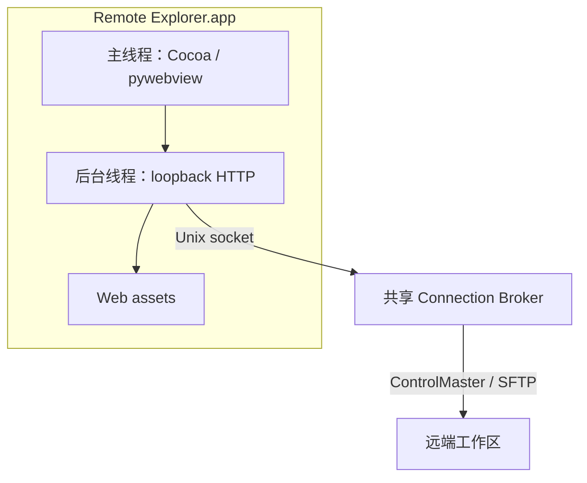

# macOS pywebview Desktop MVP 实施计划

## Summary

在当前 `feat/connection-broker` 基础上创建
`feat/macos-pywebview-desktop`，实现 macOS arm64 的 pywebview Desktop MVP。

Desktop 继续复用现有 Remote Explorer：

- pywebview 只提供 Cocoa 单窗口。
- 现有 `ExplorerHTTPServer` 在随机 loopback 端口运行。
- 现有随机 token、CSP、HTTP API 和前端资源保持不变。
- 文件与命令操作继续经过共享 Connection Broker。
- Desktop 关闭时只停止 HTTP server，不停止 Broker。

交付两个入口：

1. 开发入口：`python3 remote.py --config ... desktop`。
2. 本机 unsigned `Remote Explorer.app`，由 py2app 构建，可从 Finder 启动。

本期不实现签名、公证、DMG、自动更新、Windows/Linux Desktop、多窗口、profile
切换、配置编辑器或原生 UI 重写。

### 目标架构



## Current State Analysis

### Repository

- 当前分支：`feat/connection-broker`。
- 当前 HEAD：`e4bf6d7`。
- Connection Broker 核心提交：`65d8063`。
- 已有未提交 Desktop 草案：
  `draft.docs/10-macos-pywebview-desktop.md`。
- `draft.docs/README.md` 已有该草案索引的未提交修改。
- `only4test/hello.txt` 有用户修改；用户已明确允许提交。
- `.trae/` 为未跟踪计划资料，不纳入产品提交。

### Existing Runtime

- `sshbridge/web.py::create_server` 已支持 `port=0`、随机 token、loopback bind 和
  Broker-backed `WorkspaceService`。
- `sshbridge/web.py::serve` 当前直接执行阻塞式 `serve_forever`，并可打开系统浏览器。
- `sshbridge/web_assets/` 已提供目录树、编辑、保存、冲突处理和显式 reconnect。
- `sshbridge/cli.py` 已统一加载 config/profile，可自然增加 `desktop` 子命令。
- `BrokerClient.ensure_started` 当前使用：

  ```text
  sys.executable -m sshbridge.broker --serve --detach ...
  ```

  普通 Python 环境可用，但 py2app 冻结后 `sys.executable` 是 App launcher，不能
  假定支持 `-m`。`.app` 必须包含独立 Broker helper。

### Local Environment

- macOS `26.6.2`，Apple Silicon `arm64`。
- 当前 `/usr/bin/python3` 为 Apple Command Line Tools Python `3.9.6`。
- Homebrew 位于 `/opt/homebrew`，但尚未安装 Homebrew Python。
- `pywebview`、PyObjC 和 py2app 当前均未安装。
- 已与用户确认使用 Homebrew Python 3.12，不使用 Apple Python 3.9 构建 Desktop。
- 当前可用版本：
  - pywebview `6.2.1`，支持 Python 3.8+。
  - PyObjC `12.2.2`，要求 Python 3.10+。
  - py2app `0.28.10`，支持 Python 3.12。

## Proposed Changes

### 1. 建立功能分支并提交已有变更

从当前 HEAD 创建：

```text
feat/macos-pywebview-desktop
```

提交边界：

1. `docs: add macos desktop design`
   - `draft.docs/10-macos-pywebview-desktop.md`
   - `draft.docs/README.md`
2. `test: update persistent workspace fixture`
   - `only4test/hello.txt`
3. `feat: add macos desktop app`
   - Desktop runtime、打包、测试和正式文档。

不提交 `.trae/`、虚拟环境、build/dist、`.app`、日志或本机配置。

### 2. 隔离 macOS Desktop 依赖

新增 `requirements-desktop-macos.txt`，锁定：

```text
pywebview==6.2.1
pyobjc-core==12.2.2
pyobjc-framework-Cocoa==12.2.2
pyobjc-framework-Quartz==12.2.2
pyobjc-framework-WebKit==12.2.2
pyobjc-framework-Security==12.2.2
pyobjc-framework-UniformTypeIdentifiers==12.2.2
py2app==0.28.10
setuptools==82.0.1
wheel==0.48.0
```

执行环境：

- 安装 Homebrew `python@3.12`。
- 使用 `/opt/homebrew/opt/python@3.12/bin/python3.12`。
- 创建仓库内被忽略的 `.venv/desktop-macos`。
- 所有 Desktop 依赖只安装到该虚拟环境。
- 基础 `/usr/bin/python3` 测试继续验证零第三方依赖路径。

`.gitignore` 增加：

```text
packaging/macos/build/
packaging/macos/dist/
*.app/
```

`.venv/` 已被忽略，不新增重复规则。

### 3. 实现 Desktop 生命周期

新增 `sshbridge/desktop.py`。

公开边界：

```python
run_desktop(profile, config_path, webview_module=None,
            server_factory=create_server) -> int
resolve_desktop_config_path(explicit=None, environ=None,
                            home=None, frozen=None) -> str
app_main(argv=None) -> int
```

`run_desktop`：

- 仅允许 `sys.platform == "darwin"`。
- 要求 profile 为 `connection_policy.mode == "broker"`。
- 懒加载 `webview`；缺失时返回 `DESKTOP_DEPENDENCY_MISSING`。
- 先创建 `create_server(profile, config_path, port=0)`，确保 bind 和 Broker 启动成功。
- 构造 token URL，但不打印或记录该 URL。
- 创建窗口：
  - 标题：`Remote Explorer - <profile>`。
  - 初始尺寸：`1180 x 760`。
  - 最小尺寸：`900 x 560`。
  - `resizable=True`。
  - `zoomable=False`、`draggable=False`。
- 在独立非 daemon 线程调用 `server.serve_forever(poll_interval=0.2)`。
- 在调用线程执行 `webview.start(private_mode=True)`，保持 Cocoa GUI loop 在主线程。
- 正常退出、创建窗口失败或 GUI loop 异常时统一：
  - `server.shutdown()`。
  - `server.server_close()`。
  - `thread.join(timeout=5)`。
- 清理失败返回 `DESKTOP_START_FAILED`，不得静默遗留 listener。
- 不调用 `BrokerClient.stop()`。

错误码：

- `DESKTOP_DEPENDENCY_MISSING`
- `DESKTOP_UNSUPPORTED`
- `DESKTOP_START_FAILED`

`resolve_desktop_config_path`：

- 显式路径优先。
- packaged app 依次读取：
  1. `SSHBRIDGE_CONFIG`
  2. `~/Library/Application Support/SSHBridge/bridge.json`
- 路径必须展开 `~` 并转绝对路径。
- packaged app 不回退 app bundle 内配置，也不携带真实 profile。

`app_main`：

- 供 py2app launcher 使用。
- 支持 `--config` 与 `--profile`，Finder 无参数启动时使用上述配置发现。
- config/profile 错误时使用 pywebview inline HTML 显示只读启动错误；错误文本必须经
  `html.escape`，不启动 Explorer HTTP server。
- 返回非零退出码并同时写入 stderr/Console，内容不得包含 SSH 凭据。

### 4. 复用并收紧 Web Server 边界

修改 `sshbridge/web.py`：

- 新增 `explorer_url(server)`，集中生成 token URL。
- `serve` 与 Desktop 均调用该 helper。
- `serve` 保持现有打印 URL 和浏览器行为。
- Desktop 只获取 URL，不输出 token。
- 将固定 `ASSET_DIR` 改为资源解析函数：
  - 普通运行使用包目录 `sshbridge/web_assets`。
  - py2app frozen 运行使用 `RESOURCEPATH/web_assets`。
- 资源路径只允许固定白名单中的 `index.html`、`app.js`、`styles.css`。
- 保留 `127.0.0.1`、随机 token、CSP、no-store 和虚拟路径响应。

不采用 pywebview 内置 HTTP server，也不增加 `window.pywebview.api`。现有 Web API
继续是唯一 UI 后端。

### 5. 处理未保存内容关闭

修改 `sshbridge/web_assets/app.js`：

- `updateDirtyState()` 同步设置
  `document.documentElement.dataset.dirty = "true" | "false"`。
- 浏览器原有 `beforeunload` 行为保留。

Desktop 在 `window.events.closing` 中：

- 用 `window.evaluate_js` 读取上述只读 dirty 标记。
- dirty 为 false 或页面尚未加载时允许关闭。
- dirty 为 true 时调用 pywebview `window.create_confirmation_dialog`。
- 用户取消时 handler 返回 `False`，阻止关闭。

这里只使用 Python 调用 JS 和原生确认框，不向 JS 暴露 Python API。

### 6. CLI 入口

修改 `sshbridge/cli.py`：

- 新增 `desktop` 子命令。
- 复用已有全局 `--config` 和 `--profile`。
- 禁止 `--json desktop`。
- Desktop 不接受 host/port；HTTP 固定 loopback 随机端口。
- 懒导入 `sshbridge.desktop`，避免其他命令加载 pywebview。
- Desktop 错误继续通过 `BridgeError` 的现有文本/JSON 边界输出。
- `serve` 行为保持兼容。

### 7. Frozen Broker Helper

修改 `sshbridge/broker_client.py`：

- 抽取 `_broker_launch_argv(config_path, profile_name)`。
- 普通 Python 模式继续返回：

  ```text
  <sys.executable> -m sshbridge.broker --serve --detach ...
  ```

- py2app frozen 模式返回：

  ```text
  <app>/Contents/MacOS/sshbridge_broker --serve --detach ...
  ```

- helper 必须位于当前 App 的 `Contents/MacOS`，且为当前用户可执行的普通文件。
- helper 缺失时返回 `BROKER_UNAVAILABLE`，不得回退 direct 或尝试 app launcher
  的 `-m`。
- 普通 CLI 自动启动行为和协议不变。

新增 `packaging/macos/sshbridge_broker.py`，只调用
`sshbridge.broker.main()`。通过 py2app `extra_scripts` 将它安装为
`Contents/MacOS/sshbridge_broker`。

### 8. py2app App Bundle

新增：

```text
packaging/macos/desktop_app.py
packaging/macos/sshbridge_broker.py
packaging/macos/setup.py
packaging/macos/build_app.sh
```

`desktop_app.py`：

- 调用 `sshbridge.desktop.app_main()`。
- 不包含 profile、host、root 或凭据。

`setup.py`：

- App 名：`Remote Explorer`。
- Bundle ID：`com.sshbridge.remote-explorer`。
- 版本：`0.1.0`。
- app target：`packaging/macos/desktop_app.py`。
- `argv_emulation=False`。
- packages 包含 `sshbridge` 和 pywebview 所需模块。
- data files 将 `sshbridge/web_assets/*` 放到
  `Contents/Resources/web_assets/`。
- `extra_scripts` 包含 `packaging/macos/sshbridge_broker.py`。
- 不设置未验证的最低 macOS 版本；MVP 只承诺当前 arm64 构建机。
- 不包含自定义图标，沿用通用 app icon；图标设计不进入本期。

`build_app.sh`：

- `set -euo pipefail`。
- 验证 `Darwin`、`arm64` 和 Homebrew Python 3.12 路径。
- 使用 `.venv/desktop-macos`。
- 安装锁定 requirements。
- 清理仅限 `packaging/macos/build` 与 `packaging/macos/dist`。
- 使用非 editable source 运行 py2app standalone build。
- 验证：
  - `Remote Explorer.app` 存在。
  - `Contents/MacOS/Remote Explorer` 可执行。
  - `Contents/MacOS/sshbridge_broker` 可执行。
  - `Contents/Resources/web_assets` 完整。
- 输出本地 `.app` 路径，不创建 DMG，不签名、不公证。

### 9. Tests

新增 `tests/test_desktop.py`：

- platform gate。
- 缺失 pywebview 错误。
- 窗口参数和 token URL。
- GUI loop 调用线程。
- HTTP thread 正常/异常清理。
- Desktop 不停止 Broker。
- dirty close confirmation 的允许/取消分支。
- config 路径优先级与 Finder 路径。
- startup error HTML 转义。

修改 `tests/test_broker_config.py`：

- 普通模式 broker argv 保持 `python -m`。
- frozen 模式使用同 bundle helper。
- helper 缺失/非普通文件/不可执行时失败。
- frozen 模式禁止 direct fallback。

修改 `tests/test_web.py`：

- 普通资源目录继续工作。
- 模拟 `RESOURCEPATH` 时从 bundled `web_assets` 加载。
- `explorer_url` 使用实际随机端口且包含 token。
- Desktop helper 本身不打印 token。

扩展 `tests/test_integration_local_sshd.py` 或在 `test_desktop.py` 使用 LocalSshd：

- fake WebView 启动 Desktop controller 后可访问 `/api/info`、`/api/list`。
- CLI 与 Desktop 共用 Broker，`tcp_generation` 保持 1。
- 关闭 controller 后端口释放。
- 远端断开时保持 `CONNECTION_PAUSED`，不自动 reconnect。

自动测试不启动真实 Cocoa GUI，避免 CI/headless 环境不稳定。

### 10. Documentation

修改：

- `README.md`
  - Desktop 安装、`remote desktop`、配置路径和构建命令。
  - unsigned `.app`、arm64、本机构建限制。
  - Desktop 仍经过 loopback API 与 Broker。
- `AGENTS.md`
  - Desktop 前端不得绕过 Web API/Broker。
  - pywebview 为隔离可选依赖。
  - frozen Broker 必须通过 bundled helper 启动。
- `.gitignore`
  - macOS build/dist 和 `.app`。
- `draft.docs/10-macos-pywebview-desktop.md`
  - 状态改为已实现。
  - 补充 frozen Broker helper、锁定版本和实际验证结果。
  - 实现提交后写入 commit hash。
- `draft.docs/README.md`
  - 标记 macOS MVP 实现状态。

## Assumptions & Decisions

- 用户已批准 `draft.docs/10-macos-pywebview-desktop.md` 的范围。
- 用户已批准提交 `only4test/hello.txt` 当前修改。
- 使用 Homebrew Python 3.12；不使用 Apple CLT Python 3.9 构建 Desktop。
- 目标仅为当前 Apple Silicon `arm64` macOS 构建机。
- pywebview `6.2.1`，PyObjC `12.2.2`，py2app `0.28.10`。
- App 名为 `Remote Explorer`，Bundle ID 为
  `com.sshbridge.remote-explorer`，版本为 `0.1.0`。
- Desktop 只支持 broker mode；不提供 direct fallback。
- 继续使用现有 loopback HTTP API 与随机 token，不启用 pywebview JS API。
- Broker 是共享长期进程；关闭 Desktop 不停止 Broker。
- unsigned `.app` 仅作本机 MVP，不宣称可分发。
- `.trae/` 计划文件不提交。

## Verification

### Core Regression

使用基础 Python：

```sh
python3 -m unittest discover -s tests -v
python3 -m compileall -q sshbridge tests remote.py
node --check sshbridge/web_assets/app.js
git diff --check
```

确认未安装 pywebview 的基础 Python 仍可运行除 `desktop` 外的所有命令。

### Desktop Environment

```sh
/opt/homebrew/opt/python@3.12/bin/python3.12 -m venv .venv/desktop-macos
.venv/desktop-macos/bin/python -m pip install \
  -r requirements-desktop-macos.txt
.venv/desktop-macos/bin/python -m unittest \
  tests.test_desktop tests.test_broker_config tests.test_web -v
```

核对 `importlib.metadata.version` 与锁定版本一致。

### Real macOS Window

使用隔离 `tests/local_sshd.py` 配置启动：

```sh
.venv/desktop-macos/bin/python remote.py \
  --config <temporary-config> desktop
```

检查：

- 未打开系统浏览器。
- Cocoa 窗口、Dock、Cmd+Tab、Retina、浅色/深色模式正常。
- 目录、读取、编辑、保存、重命名和 reconnect 正常。
- dirty 文件在 Cmd+W/Cmd+Q 时显示确认框。
- 关闭窗口后 HTTP listener 消失，Broker 保持可用。
- `lsof` 显示一个 Broker ControlMaster TCP。
- 使用 macOS screenshot 并检查布局无重叠、空白或资源缺失。

### App Bundle

```sh
packaging/macos/build_app.sh
```

验证：

```sh
plutil -lint "packaging/macos/dist/Remote Explorer.app/Contents/Info.plist"
file "packaging/macos/dist/Remote Explorer.app/Contents/MacOS/Remote Explorer"
file "packaging/macos/dist/Remote Explorer.app/Contents/MacOS/sshbridge_broker"
```

运行 bundle 主可执行文件时使用临时 `SSHBRIDGE_CONFIG` 验证完整工作流。再通过 Finder
打开 `.app` 验证缺省配置发现或安全的启动错误窗口。

确认：

- frozen App 可通过 bundled helper 自动启动 Broker。
- helper 关闭启动器后 Broker 继续服务 CLI。
- App 退出后 HTTP 线程和端口清理。
- bundle 内不包含 `bridge.json`、SSH 私钥、状态文件、测试临时目录或 `.trae/`。

### Final Git Check

- 工作树仅允许 `.trae/` 保持未跟踪。
- `only4test/hello.txt` 已按用户许可提交。
- build/dist、`.app`、虚拟环境和本机配置未提交。
- 提交历史使用短、事实型 caveman commit：
  - `docs: add macos desktop design`
  - `test: update persistent workspace fixture`
  - `feat: add macos desktop app`
