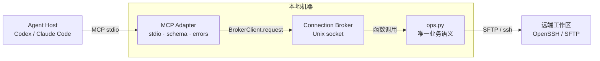
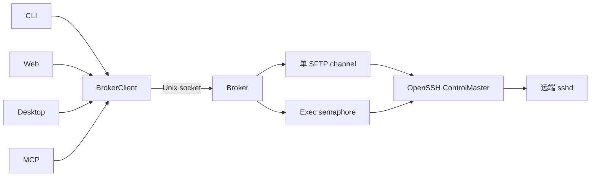
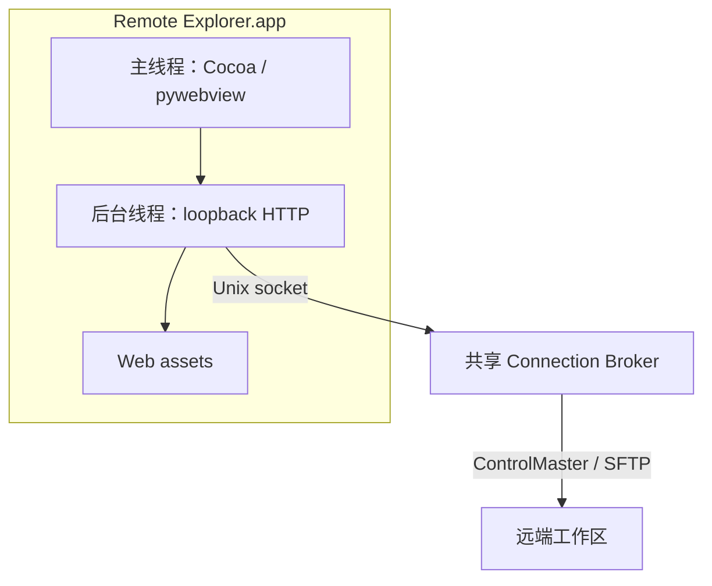

# MCP Server MVP 实施计划

## Summary

从当前 `main` 创建 `feat/mcp-server`，实现本地 stdio MCP Server，使 Codex、
Claude Code 等 MCP Host 能直接调用现有远程工作区能力。

MCP Server 是协议 Adapter，不是第二套业务实现：

* MCP Host 通过 stdio 启动并调用 `sshbridge.mcp_server`。

* MCP Adapter 负责 Tool Schema、参数校验、结果转换和 MCP 错误语义。

* 所有业务请求只调用 `BrokerClient`。

* Connection Broker 继续统一管理每个 profile 的 OpenSSH ControlMaster、SFTP、
  Exec 并发和熔断状态。

* Broker 继续调用 `sshbridge/ops.py`，MCP 不复制文件安全或命令执行逻辑。

* MCP 退出不停止共享 Broker。

首期只提供 tools，不提供 resources、prompts、Streamable HTTP、SSE、远端 MCP
进程、动态 profile 切换、会话型长命令或 MCP 内部 Agent Loop。

### 目标架构



## Current State Analysis

### Repository

* 当前分支：`main`。

* 当前 HEAD：`185fbeb`。

* 工作树干净。

* CLI、Connection Broker、Web Explorer、macOS Desktop 和远程删除已实现。

* 当前完整测试数为 86。

* `.trae/documents/connection-broker-implementation-plan.md` 与
  `.trae/documents/macos-pywebview-desktop-mvp-plan.md` 已纳入 Git，但尚无 Mermaid
  架构图。

* `draft.docs/02-mcp-server.md` 仍是未实施草案，Tool 列表缺少已经实现的
  `delete`、`hash_file`、`connection_status` 和 `reconnect`。

### Existing Interfaces

`sshbridge/ops.py` 已提供九项业务操作：

```text
op_list_dir
op_stat
op_read_file
op_write_file
op_mkdir
op_move
op_delete
op_exec
op_hash
```

这些函数包含路径沙箱、`REALPATH` 校验、读取限制、原子写入、冲突检测和结构化命令
结果。它们是唯一业务语义实现。

`sshbridge/broker.py::BrokerState` 已将上述操作暴露为本地 Broker operation：

```text
list_dir
stat
read_file
write_file
mkdir
move
delete
exec
hash
```

`sshbridge/broker_client.py::BrokerClient` 已提供：

* `ensure_started()`：自动启动本地 Broker，不立即连接远端。

* `request(op, args, timeout)`：通过受保护 Unix socket 调用 Broker。

* `status()`：读取 Broker 和远端连接状态。

* `reconnect()`：显式执行一次熔断恢复。

* `stop()`：显式停止共享 Broker。

MCP 不应调用 CLI 子进程，也不应直接调用 `ops.py`。前者会重新编码文本参数和错误，
后者会让 MCP 进程直接拥有 SSH/SFTP 连接。正确 seam 是
`BrokerClient.request()`。

### Local Environment

* Apple Command Line Tools Python：`3.9.6`。

* Homebrew Python：`3.12.14`。

* 当前环境未安装 `mcp` 包。

* 官方 MCP Python SDK 当前稳定版本为 `2.2.0`，要求 Python 3.10+。

* 官方 v2 使用 `MCPServer`、函数类型注解生成 JSON Schema，默认 `run()` transport
  为 stdio，并提供 `Client(server)` 内存测试 Adapter。

因此 MCP 必须使用独立 Python 3.12 环境；基础 Python 3.9 CLI/Web/Broker 继续保持
零第三方依赖。

### Gaps

* 没有 MCP Server 入口或可选依赖。

* 没有 MCP Tool Schema、Tool annotations 或错误转换。

* Broker 结果包含 `real_path` / `real_cwd`，不能直接返回给 Agent。

* `read_file` 可能同时返回文本与 Base64，直接暴露会重复占用上下文。

* `exec` 输出和大目录结果可能显著增加 MCP 上下文。

* stdio stdout 是协议通道，任何启动日志或 `print()` 都会破坏协议。

* 现有测试没有 MCP SDK 内存调用、stdio 子进程或多 MCP 客户端共享 Broker 覆盖。

## Proposed Changes

### 1. 建立功能分支与提交边界

从 `main` 创建：

```text
feat/mcp-server
```

计划提交：

1. `docs: finalize mcp server plan`

   * 新增本实施计划。

   * 更新 `draft.docs/02-mcp-server.md`。

   * 给前两份实施计划补充 Mermaid 架构图。
2. `feat: add stdio mcp server`

   * MCP 依赖、runtime、tools、Broker Adapter 和错误转换。
3. `test: verify mcp broker integration`

   * SDK 内存测试、stdio 测试、本地 sshd 与多客户端共享测试。
4. `docs: document mcp server`

   * README、AGENTS、草案状态和实现提交链接。

不提交 `.venv/`、MCP Inspector 产物、日志、本机 MCP Host 配置、`bridge.json`、
Broker 状态或凭据。

### 2. 隔离 MCP 可选依赖

新增 `requirements-mcp.txt`：

```text
mcp==2.2.0
```

开发环境：

```sh
/opt/homebrew/opt/python@3.12/bin/python3.12 -m venv .venv/mcp
.venv/mcp/bin/python -m pip install -r requirements-mcp.txt
```

约束：

* MCP SDK 只安装到 `.venv/mcp`。

* 不将 MCP SDK 加入基础 CLI/Web/Broker 运行路径。

* `sshbridge.mcp_server` 懒加载 SDK；依赖缺失时只向 stderr 输出
  `MCP_DEPENDENCY_MISSING`，不得向 stdout 写入非协议数据。

* Apple Python 3.9 继续运行现有完整测试。

### 3. 新增 MCP Server Module

新增 `sshbridge/mcp_server.py`。

公开入口：

```python
create_mcp_server(
    profile,
    config_path,
    mcp_module=None,
    broker_client_factory=BrokerClient,
)

app_main(argv=None) -> int
```

`app_main`：

* 解析必需的绝对 `--config` 和可选 `--profile`。

* profile 缺省为 config 的 `default_profile`。

* 只允许 `connection_policy.mode=broker`。

* 创建一个 `BrokerClient` 并执行 `ensure_started()`。

* 创建 MCP Server 后调用同步 `mcp.run()`，使用默认 stdio transport。

* 正常退出时不调用 `BrokerClient.stop()`。

* 所有诊断使用 `logging` / stderr；stdout 在进入 SDK 前后均不得打印。

* config、profile、SDK 或 Broker 初始化失败时返回非零退出码。

模块级 MCP Server 对象不在 import 时自动运行；`run()` 必须位于
`if __name__ == "__main__"` 路径。

### 4. 实现内部 MCP Adapter

在 `sshbridge/mcp_server.py` 内实现私有 `_McpBrokerAdapter`，其外部 interface 只有：

```python
async call(operation, arguments, timeout) -> dict
async status() -> dict
async reconnect() -> dict
```

该 Adapter 隐藏：

* `BrokerClient.ensure_started()` 和 request timeout。

* `write_file` UTF-8 到 Base64 的 Broker 编码。

* `read_file` 文本/Base64 二选一输出。

* `real_path`、`real_cwd` 和配置 root 的移除。

* `BridgeError` 到 MCP Tool error 的转换。

* MCP 结果大小限制。

阻塞 Broker 调用通过 `asyncio.to_thread()` 执行，避免阻塞 MCP SDK 事件循环。每次
Tool 调用创建独立 Unix socket request；Broker 继续负责 SFTP 串行和 Exec semaphore。

不增加第二个通用 operation registry。Broker operation 名称是现有内部 interface，
MCP tool wrapper 只负责类型化参数和调用 Adapter。

### 5. 暴露 11 个 MCP Tools

#### 只读 Tools

```text
list_dir(path="/")
stat(path)
read_file(path, offset=0, limit=None, encoding="text")
hash_file(path)
connection_status()
```

* annotations：
  `read_only_hint=True`、`destructive_hint=False`、
  `idempotent_hint=True`。

* `open_world_hint=False`，因为访问范围是配置的封闭工作区或本地 Broker 状态。

`read_file`：

* `encoding` 只允许 `text` 或 `base64`。

* 默认最多读取 `min(profile.max_read_bytes, 1 MiB)`。

* 返回 `offset`、`length`、`size`、`mtime` 和 `truncated`。

* `text` 使用严格 UTF-8；二进制或非法 UTF-8 返回稳定 `BINARY_FILE` Tool error，
  提示调用方改用 `encoding="base64"`。

* `base64` 只返回 `content_b64`，不同时返回替换文本。

#### 写操作 Tools

```text
write_file(
    path,
    content,
    expected_mtime=None,
    expected_size=None,
    expected_hash=None,
    force=False,
)
mkdir(path, parents=False)
move(src, dst, force=False)
delete(path)
```

* `write_file` 首期只接受 UTF-8 文本，最大 1 MiB；二进制写入留作后续独立 Tool。

* 保留 expected mtime、size、SHA-256 和 force 语义。

* `delete` 只删除文件、符号链接或空目录；根目录和非空目录继续被拒绝。

* `write_file`、`move`、`delete` 标记
  `destructive_hint=True`。

* `mkdir` 标记 `destructive_hint=False`。

* 写操作均标记 `idempotent_hint=False`。

#### 命令与连接 Tools

```text
exec(command, cwd="/", timeout=None)
reconnect()
```

`exec`：

* 默认暴露，保持 Coding Agent 的完整命令能力。

* Tool 描述必须明确：`cwd` 只是起始目录，不是命令沙箱。

* annotations：
  `read_only_hint=False`、`destructive_hint=True`、
  `idempotent_hint=False`、`open_world_hint=True`。

* stdout/stderr 结果序列化超过 1 MiB 时返回 `TOO_LARGE`，明确说明命令可能已经
  执行完成，并建议将输出重定向到远端文件后使用分页读取。

`reconnect`：

* 是用户或 Agent 发起的显式恢复动作，符合 Broker 禁止自动重连的规则。

* 只允许 Broker 自己执行一次连接尝试。

* 不提供 `broker stop` Tool，防止一个 Agent 停止其他客户端共享连接。

### 6. MCP Result 与 Error 语义

成功结果：

```json
{
  "ok": true,
  "result": {}
}
```

* 返回普通 Python dict，由 SDK 生成 `structuredContent` 和 output schema。

* 同时保留 SDK 自动生成的文本内容，供模型直接读取。

* 所有 `real_path`、`real_cwd` 和真实远端 root 在进入 MCP 前移除。

失败结果遵循官方 SDK v2 Tool error 语义：

* `BridgeError` 转换为 SDK `ToolError`，使 `CallToolResult.isError=true`。

* ToolError 文本为单行 canonical JSON：

  ```json
  {
    "ok": false,
    "error": {
      "code": "CONFLICT",
      "message": "...",
      "details": {}
    }
  }
  ```

* SDK v2 的失败 Tool Result 不提供 `structuredContent`；稳定错误结构放在模型可读取的
  JSON 文本中，不把业务错误错误地包装成 `isError=false` 成功结果。

* 未预期异常由 SDK 隐藏内部详情，日志写 stderr，客户端只收到通用 Tool error。

* 不将 `BridgeError` 转换为顶层 JSON-RPC `MCPError`；业务失败属于 Tool 执行结果，
  模型应有机会修正参数或调用 `reconnect`。

结果序列化上限：

```text
MCP_MAX_RESULT_BYTES = 1 MiB
```

超过上限返回 `TOO_LARGE`，不得静默截断；`read_file.truncated=true` 的显式分页结果
除外。

### 7. 配置与 Host 启动方式

Agent 配置使用专用 Python 和绝对路径：

```json
{
  "mcpServers": {
    "sshbridge-legacy-linux": {
      "command": "/absolute/path/.venv/mcp/bin/python",
      "args": [
        "-m",
        "sshbridge.mcp_server",
        "--config",
        "/absolute/path/bridge.json",
        "--profile",
        "legacy-linux"
      ]
    }
  }
}
```

约束：

* 单 MCP 进程绑定一个 profile。

* Host 工作目录不参与 config 发现。

* 配置文件仍只保存于本机，不复制进 SDK 环境或远端。

* SSH key、Agent、ProxyJump、known hosts 继续由系统 OpenSSH 管理。

* 多个 Host/MCP 进程使用相同 config/profile 时命中同一个 Broker fingerprint。

### 8. 测试

新增 `tests/test_mcp_server.py`：

* SDK 缺失返回 `MCP_DEPENDENCY_MISSING` 且不污染 stdout。

* config 必须是绝对路径。

* direct profile 被拒绝。

* `tools/list` 返回 11 个 Tool、稳定名称、Schema 与 annotations。

* 各 Tool 到 Broker operation 的参数映射和 timeout。

* `write_file` UTF-8/Base64 转换。

* `read_file` text/base64、分页、二进制错误。

* 成功结果移除 `real_path` / `real_cwd`。

* `BridgeError` 生成 `isError=true` 且 JSON 文本保留 code/details。

* 未预期错误不泄漏内部异常或凭据。

* 1 MiB 输入/输出限制。

* MCP 生命周期不调用 Broker stop。

测试使用 `unittest.IsolatedAsyncioTestCase` 和 SDK `Client(mcp)`，不引入 pytest。

新增或扩展 `tests/test_integration_local_sshd.py`：

* 通过 MCP SDK stdio Client 启动真实 `python -m sshbridge.mcp_server`。

* 完整验证 list/stat/read/write/mkdir/move/delete/hash/exec。

* 验证写入冲突、二进制 Base64、非空目录删除和符号链接越界。

* 验证连接断开后返回 `CONNECTION_PAUSED`，调用 `reconnect` 后恢复。

* 同时启动两个 MCP Server，确认 Broker `tcp_generation=1`。

* MCP Server 退出后 CLI/Web 继续使用同一 Broker。

* MCP 进程不直接产生独立远端 SSH owner。

* stdout 只包含 MCP framing；stderr 日志不进入协议。

MCP 测试缺少 Python 3.12 或 SDK 时只跳过 MCP 专项测试；基础测试不得跳过。

### 9. 更新正式文档与草案

修改 `draft.docs/02-mcp-server.md`：

* 增加与本计划一致的 Mermaid 目标架构图。

* 状态从“当前没有 MCP Server”更新为实际实现状态。

* Tool 列表更新为 11 项。

* 记录 SDK 版本、Python 3.12 隔离环境、stdio、错误语义和输出上限。

* 增加实际实现代码摘录和提交 hash。

修改 `README.md`：

* MCP Python 3.12 环境安装。

* MCP Server 启动命令。

* Host 配置示例。

* Tool 列表、危险操作、输出限制和 Broker 共享语义。

* 架构列表增加 `sshbridge/mcp_server.py`。

* 状态标记 MCP MVP 已实现。

修改 `AGENTS.md`：

* MCP 必须使用 Broker，禁止 direct fallback。

* MCP stdout 只能承载协议。

* MCP SDK 为隔离可选依赖。

* MCP 返回不得暴露真实 root、SSH 参数或凭据。

* `exec` 的命令安全边界保持不变。

* 新 Tool 必须同时验证 Schema、Broker mapping 和错误语义。

修改 `draft.docs/README.md`：

* 标记 MCP stdio MVP 实现状态。

### 10. 给前两份实施计划补图

修改 `.trae/documents/connection-broker-implementation-plan.md`，在 Summary 后增加
Mermaid 目标架构图：



图只表达 Connection Broker 的连接所有权和并发通道，不重写该计划的历史
Current State Analysis。

修改 `.trae/documents/macos-pywebview-desktop-mvp-plan.md`，在 Summary 后增加
Mermaid 目标架构图：



图只表达 Desktop 线程、HTTP、Broker 与远端关系，并保留 frozen helper 的正文说明。

### 11. 提交与合并

实现完成后：

* 更新 `draft.docs/02-mcp-server.md` 的状态与实现提交 hash。

* 运行完整验证。

* 确认 `.venv/mcp`、Inspector 产物、日志和 Host 配置未进入 Git。

* 使用临时 worktree 将 `feat/mcp-server` 快进合并到 `main`，避免覆盖可能出现的用户
  工作区修改。

* 不执行远程 push。

## Assumptions & Decisions

* 用户确认 MCP Server 的目标是将现有能力封装为 Agent 可调用 MCP tools。

* 使用官方 MCP Python SDK `2.2.0`，不手写 MCP JSON-RPC。

* 使用 Homebrew Python 3.12；基础 Python 3.9 保持无 MCP 依赖。

* transport 仅为 stdio；不监听 TCP。

* 一个 MCP 进程绑定一个 profile。

* MCP 只调用 Broker，不直接调用 `ops.py`、SFTP 或 OpenSSH。

* Broker 仍是远端连接的唯一 owner。

* 首期提供 11 个 tools，不提供 resources 和 prompts。

* `exec` 默认暴露，并明确标记为可能破坏性、开放世界操作。

* `reconnect` 暴露为显式 Tool；不暴露 Broker stop。

* 文本读写为首期默认；二进制读取显式 Base64，二进制写入后续实现。

* MCP 单次结果上限为 1 MiB。

* 业务错误使用 `isError=true` Tool Result；不伪装成成功结果。

* MCP 输出不暴露真实远端 root、SSH 参数或凭据。

* 三份实施计划统一使用 Mermaid，图是目标架构说明，不是运行时生成资源。

## Verification

### Base Regression

使用 Apple Python 3.9，在未安装 MCP SDK 的环境运行：

```sh
/usr/bin/python3 -m unittest discover -s tests -v
/usr/bin/python3 -m compileall -q sshbridge tests remote.py
node --check sshbridge/web_assets/app.js
git diff --check
```

确认 CLI、Broker、Web 与 Desktop 非 MCP 路径不导入 `mcp`。

### MCP Environment

```sh
/opt/homebrew/opt/python@3.12/bin/python3.12 -m venv .venv/mcp
.venv/mcp/bin/python -m pip install -r requirements-mcp.txt
.venv/mcp/bin/python -c \
  'import importlib.metadata as m; print(m.version("mcp"))'
.venv/mcp/bin/python -m unittest tests.test_mcp_server -v
```

确认版本为 `2.2.0`。

### SDK In-Memory Verification

使用官方 `Client(mcp, raise_exceptions=True)`：

* 列出 11 个 tools。

* 校验 input/output schema。

* 调用成功 Tool 并检查 `structured_content`。

* 调用失败 Tool 并检查 `is_error=true` 和 canonical JSON error text。

* 确认真实远端 root 不出现在结果或错误中。

### Stdio Verification

由官方 Client 启动：

```text
.venv/mcp/bin/python -m sshbridge.mcp_server \
  --config <absolute-test-config> \
  --profile local-test
```

确认：

* stdout 无启动 banner、日志或 traceback。

* `tools/list` 和 `tools/call` 正常。

* 正常 EOF 后 MCP 退出。

* Broker 继续运行。

### Local OpenSSH Integration

使用 `tests/local_sshd.py` 的临时模式：

* 执行全部 11 个 tools。

* 覆盖读写冲突、分页、二进制、删除、路径逃逸和命令超时。

* 两个 MCP Client 与 CLI/Web 并发时只存在一个 Broker 和一个
  `tcp_generation`。

* 远端断开后不自动重连。

* `reconnect` 每次只产生一次受门控连接尝试。

### Documentation Diagrams

* 三份 `.trae/documents/*implementation-plan.md` 均包含 Mermaid。

* Mermaid 节点名称、调用方向和实现文件与当前代码一致。

* 图中不包含真实 host、root、用户名、token 或本机凭据。

* Markdown fenced blocks 配对且 `git diff --check` 通过。

### Final Git Check

* `requirements-mcp.txt` 仅包含批准的 MCP 依赖。

* `.venv/mcp`、MCP Inspector 产物、日志、本机 Host 配置和 `bridge.json` 未提交。

* `main` 合并前功能分支完整测试通过。

* 合并使用 `--ff-only`。

* 不执行远程 push。

## References

* MCP Python SDK：<https://pypi.org/project/mcp/>

* MCP Python SDK Get Started：
  <https://py.sdk.modelcontextprotocol.io/get-started/>

* MCP Server Tools：
  <https://py.sdk.modelcontextprotocol.io/servers/tools/>

* MCP Error Handling：
  <https://py.sdk.modelcontextprotocol.io/servers/handling-errors/>

* MCP stdio Runtime：
  <https://py.sdk.modelcontextprotocol.io/run/>

