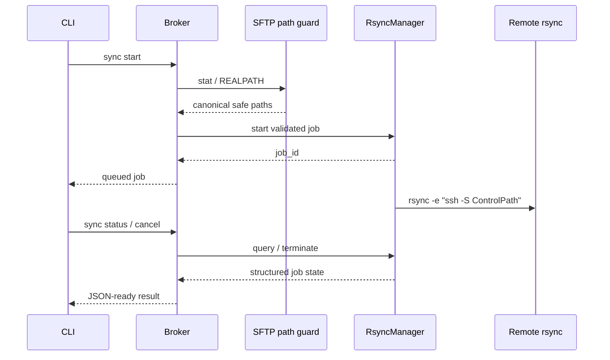
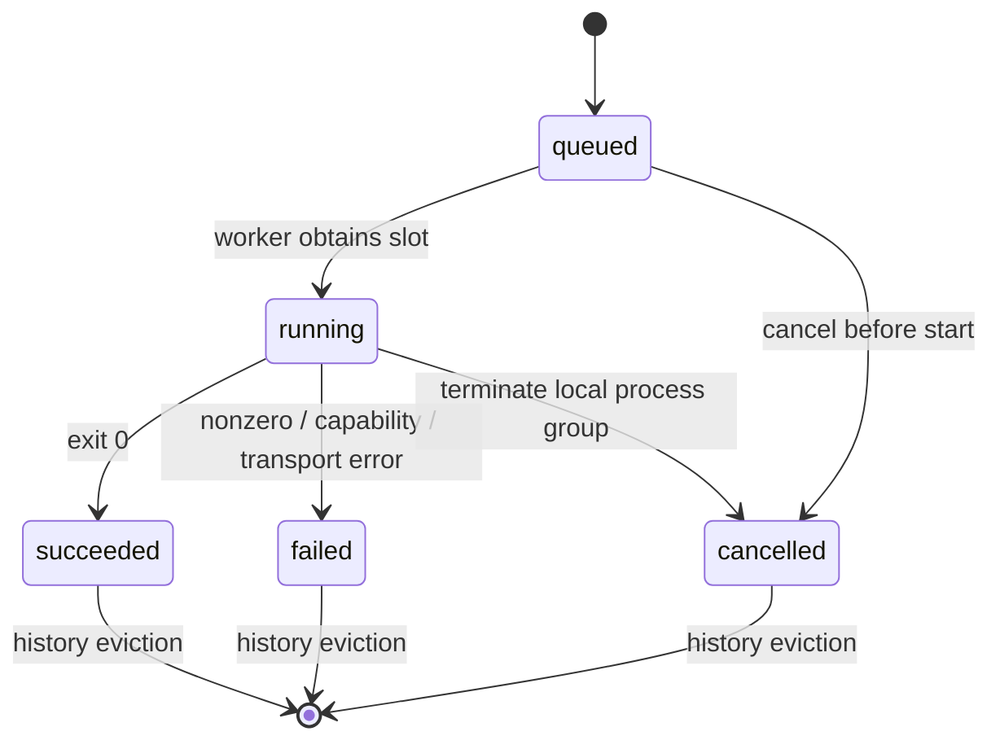

# Rsync 批量传输 MVP 实施计划

## Summary

在不改变远端基础依赖假设的前提下，为已安装兼容 Rsync 的 profile 增加可选批量传输
通道。首版只提供 CLI 与 Connection Broker 接口，传输任务异步执行、单并发，并通过
现有 OpenSSH ControlMaster 复用 SSH TCP；目录浏览和普通文件操作继续使用单独的
SFTP channel。

本计划收窄 `draft.docs/06-rsync-batch-transfer.md` 的原始范围：

- 首版提供 push、pull、status、cancel，不提供 Web/Desktop UI。
- 首版不自动回退 SFTP。能力不足时返回稳定错误，避免大文件静默占用交互 SFTP 锁。
- 只有 ControlMaster 可用时才允许启动 Rsync；不得为了传输额外建立 SSH TCP。
- push 支持一个或多个显式本地源；pull 首版只支持一个远端文件或目录。
- 远端 push 目标和本地 pull 目标都必须是已存在目录。
- 不接受任意 Rsync 参数，不支持 `--delete`、过滤规则、双向同步或镜像语义。
- 任务状态只保存在 Broker 内存中；Broker 重启后旧 job ID 失效。

实施必须在从 `main` 创建的独立 `feat/rsync-batch-transfer` worktree 中进行。当前
工作区位于 `feat/mcp-server`，并有独立的 MCP commit 和未跟踪
`requirements-mcp.txt`；不得把仅属于 MCP 分支的文件带入 Rsync 分支，也不得覆盖
或清理它们。创建 worktree 时以执行当时的 `main` 为基线；若 MCP 已先合并，则自然
继承已合并的公共代码。

## Current State Analysis

### 已有能力

- `sshbridge/transport.py::OpenSSHTransport` 为每个 profile 管理一个 ControlMaster，
  并向 channel profile 注入 `control_path`。
- `sshbridge/broker.py::BrokerState` 已将资源锁分开：
  - `connect_lock` 管理连接状态。
  - `sftp_lock` 串行化单一 SFTP session。
  - `ExecJobManager` 限制同步与异步 Exec channel。
- `sshbridge/ops.py` 已实现所有远端文件操作的 `REALPATH` 与 canonical root 校验。
- Broker 请求和结果均为 JSON-ready dict，稳定错误通过 `BridgeError` 返回。
- 集成测试已经验证 Exec 与 SFTP 可通过同一 ControlMaster TCP 并行。
- Windows named pipe 尚未实现，正式 Broker 当前只支持 POSIX Unix socket。

### 当前缺口

- 没有 Rsync 能力探测、参数构造、任务队列、状态查询或取消逻辑。
- `Profile` 没有本地或远端 Rsync executable 配置。
- Broker 只管理同步 SFTP/Exec 调用，没有异步传输任务生命周期。
- CLI 没有 `sync` 命令组。
- 当前 macOS `/usr/bin/rsync` 报告为 `openrsync / rsync 2.6.9 compatible`，
  `--help` 中没有 `--protect-args`，不能作为本 MVP 的安全传输实现。

### 必须保留的约束

- 不要求远端安装 Rsync；远端无兼容 Rsync 时基础 CLI、Web、Desktop 和 SFTP
  功能必须继续可用。
- 不允许 Rsync 绕过 remote root；远端源、目标必须先经 SFTP canonical 校验。
- 不允许隐藏 direct fallback，也不允许 Rsync 自行建立新的 SSH TCP。
- SFTP 锁只能覆盖能力探测所需的短操作和路径校验，不能覆盖传输进程生命周期。
- 本地超时或取消不能被描述为已确认终止远端进程。
- 只使用 Python 标准库；Rsync 是本地/远端可选系统能力，不是 Python 依赖。

## Architecture And Flow



关键点：

- `SFTP path guard` 只在任务启动前工作。
- `RsyncManager` 是任务所有者，不持有 `sftp_lock`。
- Rsync 的 remote shell 强制使用 Broker 当前 ControlPath。
- CLI 不直接启动 Rsync，也不直接访问 SSH。

### Job 状态机



## Proposed Changes

### 1. 隔离实施分支

从 `main` 创建独立 worktree 和 `feat/rsync-batch-transfer` 分支。不得切换、暂存或
提交当前 `feat/mcp-server` 工作区中的 MCP 专属文件。

建议执行形态：

```sh
git worktree add /tmp/BIC-Server-Harness-rsync \
  -b feat/rsync-batch-transfer main
```

所有代码、测试、构建和提交都在该 worktree 中完成。功能完成并确认后再使用
`--ff-only` 合并到 `main`。

### 2. 配置：`sshbridge/config.py`

在 profile 顶层新增两个可选配置：

```json
{
  "rsync_bin": "/opt/homebrew/bin/rsync",
  "remote_rsync_bin": "rsync"
}
```

行为：

- `rsync_bin` 默认值为 `"rsync"`，表示本地 executable 名称或绝对路径。
- `remote_rsync_bin` 默认值为 `"rsync"`，只允许简单 executable 名称或规范化的
  绝对 POSIX 路径。
- executable 名称必须匹配 `[A-Za-z0-9._+-]+`；绝对路径的每个 segment 必须匹配
  同一字符集，且 `posixpath.normpath(value) == value`。
- `remote_rsync_bin` 拒绝空白、控制字符、引号、反引号、美元符号、分号、管道符、
  shell 重定向符和 `..` 路径段。
- `rsync_bin` 通过 `shutil.which` 或绝对路径解析；目标必须存在且可执行。允许
  Homebrew executable symlink。
- 不新增远端安装逻辑。
- 不把并发、队列和缓存上限开放成配置；MVP 使用模块常量，减少接口面积。

同步更新：

- `bridge.example.json`：加入带说明的可选字段。
- `tests/test_broker_config.py`：覆盖默认值、绝对路径、非法 remote executable。

### 3. 深模块：新增 `sshbridge/rsync.py`

新增 `RsyncManager`。它是 Broker 内部的深模块，外部接口固定为：

```python
start(direction, sources, destination) -> dict
status(job_id) -> dict
cancel(job_id) -> dict
snapshot() -> dict
invalidate_capabilities() -> None
close() -> None
```

构造时由 Broker 注入以下内部 seam：

- 远端 `stat/REALPATH` 回调。
- 远端 capability probe/Exec 回调。
- 当前 ControlPath 与 SSH profile。
- transport error 回调。
- 测试可替换的 `Popen`/时钟；这些依赖不暴露给 CLI 或 Broker 协议。

不要提前抽取通用 `JobManager`。当前只有 Rsync 一个真实 adapter；未来实现
`exec_start` 时，再根据第二个真实用例判断是否提取共享任务模块。

#### 固定资源上限

```text
Rsync 并发             1
等待队列               8
已完成任务历史         32
每个任务 stdout+stderr 256 KiB
优雅取消等待           3 秒
最大 sources 数量      128
```

超过队列上限返回 `SYNC_QUEUE_FULL`。历史清理只淘汰最旧的终态任务，不能淘汰
`queued` 或 `running` 任务。

#### Job 结果

所有时间使用 Unix epoch 秒，所有字段 JSON-ready：

```json
{
  "job_id": "hex-id",
  "direction": "push",
  "state": "queued",
  "transport": "rsync",
  "submitted_at": 0,
  "started_at": null,
  "finished_at": null,
  "source_count": 2,
  "files_transferred": null,
  "bytes_transferred": null,
  "exit_code": null,
  "output_truncated": false,
  "cancel_requested": false,
  "remote_termination_unknown": false,
  "error": null
}
```

状态只允许：

```text
queued | running | succeeded | failed | cancelled
```

任务状态不返回本地绝对路径、真实远端 root、SSH 参数或 ControlPath。失败时
`error` 使用 `BridgeError.to_dict()` 结构。

#### 进程管理

- 使用 `subprocess.Popen(..., start_new_session=True)` 启动本地 Rsync。
- stdout 和 stderr 由后台 reader 持续排空，避免管道阻塞。
- 缓存达到 256 KiB 后继续排空但停止追加，并设置 `output_truncated=true`。
- `cancel` 对 queued job 直接转为 `cancelled`。
- `cancel` 对 running job 先向本地进程组发送 `SIGTERM`，3 秒未退出再发送
  `SIGKILL`。
- 取消 running job 必须返回 `remote_termination_unknown=true`；SSH channel
  关闭通常会停止远端 Rsync，但本地不能证明。
- `close()` 先取消并 join 所有任务，再允许 Broker 停止 ControlMaster。
- 内部使用一个 condition/lock 保护 queue、job records 和当前 process；执行
  capability callback、SFTP callback、`Popen`、wait、signal 或 reader join 时
  不持有该 lock。
- 使用一个专用 worker thread 消费 FIFO 队列；不为每个 queued job 创建线程。

### 4. 能力探测

首次 `sync_start` 时探测，结果缓存到 Broker 生命周期结束；`broker reconnect`
后调用 `invalidate_capabilities()`，下一次同步重新探测远端。

本地探测：

```text
<rsync_bin> --version
<rsync_bin> --help
```

远端探测通过 Broker 的现有 Exec channel：

```text
command -v <remote_rsync_bin>
<remote_rsync_bin> --version
<remote_rsync_bin> --help
```

要求：

- 本地和远端 executable 均存在。
- 本地和远端帮助文本包含 `--protect-args`，或 Rsync 3.2.6 起采用的现代名称
  `--secluded-args`；实际传输仍固定传兼容别名 `--protect-args`。
- 当前 transport 必须 `multiplexing=true` 且 ControlMaster alive。
- 不能只比较版本字符串；兼容实现可能报告不同版本格式。

当前 macOS `/usr/bin/rsync` 不满足要求。实施阶段若
`/opt/homebrew/bin/rsync` 不存在，安装 Homebrew rsync，并在真实集成测试 profile
中显式设置：

```json
{
  "rsync_bin": "/opt/homebrew/bin/rsync",
  "remote_rsync_bin": "/opt/homebrew/bin/rsync"
}
```

该设置只用于 localhost sshd 测试。正式远端仍由用户已有环境决定，不安装任何包。

### 5. 路径安全

#### Push

- 接受 1–128 个显式本地源。
- 本地源转换为绝对路径并执行 `lstat`；不存在时返回 `NOT_FOUND`。
- 去重后提交，保留源条目本身，不实现“目录尾部 `/` 表示只复制目录内容”的差异语义。
- 远端 destination 必须是已存在目录。
- destination 使用现有 SFTP session 调用 `ops.op_stat`，要求 `type=dir`，并使用
  返回的 canonical `real_path` 构造 Rsync remote operand。

#### Pull

- 首版只接受一个远端 source；目录本身已提供批量能力。
- source 必须存在，经 `ops.op_stat` 获取 canonical `real_path`。
- 若 source 或路径中间符号链接最终指向 root 外，沿用 `SANDBOX_VIOLATION`。
- 本地 destination 必须是已存在的绝对目录。

#### 共同规则

- 工作区根目录可作为 pull source 或 push destination，但不能通过词法路径逃逸。
- 远端 path 拒绝 NUL、CR、LF。
- profile host 在 Rsync 模式下只接受 hostname、IPv4 或 SSH config alias；raw IPv6
  要求用户先配置 SSH alias，避免 `host:path` 语法歧义。
- host 必须匹配 `[A-Za-z0-9._-]+`。
- 所有 operand 放在 Rsync 的 `--` 之后。
- 不扫描远端目录树；目录内部遍历由 Rsync 完成。
- 使用 `--links --safe-links`，保留安全符号链接并跳过指向传输树外部的链接；
  不使用 `--copy-links`。

### 6. Rsync argv

固定参数，不允许调用方注入额外 options：

```text
--recursive
--links
--safe-links
--times
--partial
--partial-dir=.sshbridge-partial
--stats
--protect-args
--rsync-path=<validated remote_rsync_bin>
-e <trusted ssh command>
--
```

`-e` 参数是 Rsync 固有的 remote-shell 字符串。使用 `shlex.join()` 从受信任的
profile/ControlPath argv 构造；本地路径、远端路径和用户输入不得进入该字符串。

SSH command 必须包含：

```text
-S <broker ControlPath>
-o ControlMaster=no
```

并复用 `Profile` 现有的 port、user、host-key、BatchMode、ProxyJump 和
`ssh_args`。remote operand 使用 `<profile.host>:<canonical-path>`，用户由 SSH
command 的 `-l` 指定。

Rsync 退出后在 `LC_ALL=C` 环境下解析 `--stats`：

- `Number of regular files transferred` -> `files_transferred`
- `Total transferred file size` -> `bytes_transferred`

解析失败不改变成功/失败判断；对应字段保持 `null`。exit code 0 才是
`succeeded`。

### 7. Broker：`sshbridge/broker.py`

`BrokerState` 新增一个 `RsyncManager`，并增加操作：

```text
sync_start
sync_status
sync_cancel
```

请求格式：

```json
{
  "op": "sync_start",
  "args": {
    "direction": "push",
    "sources": ["/local/a", "/local/b"],
    "destination": "/remote/dir"
  }
}
```

```json
{
  "op": "sync_status",
  "args": {"job_id": "hex-id"}
}
```

```json
{
  "op": "sync_cancel",
  "args": {"job_id": "hex-id"}
}
```

Broker 行为：

- `sync_start` 先调用 `ensure_ready()`。
- `sync_start` 的 SFTP canonical 检查在 `sftp_lock` 内完成，随后释放锁再排队。
- 任务执行期间不持有 `sftp_lock`、Exec 调度容量或 `connect_lock`。
- capability probe 使用短 Exec channel，可短暂占用 `ExecJobManager` 调度容量。
- 异步 Rsync stderr 被识别为 SSH transport failure 时，通过回调进入现有
  `OPEN` 熔断状态，不自动重连。
- `snapshot()` 增加 `sync_active`、`sync_queued`、`sync_history` 和
  `rsync_capability`；不触发主动探测。
- `reconnect()` 清除 Rsync capability cache。
- `close()` 顺序为：关闭 RsyncManager、关闭 SFTP session、停止 transport。

Broker protocol version 暂不递增；新增操作保持向后兼容。文档明确升级代码后需要
重启旧 Broker，否则旧进程会返回 unknown operation。

为避免模糊错误，Broker snapshot 新增：

```json
{
  "features": ["sftp", "exec", "rsync"]
}
```

新 CLI 在提交 `sync_start` 前检查 `features`。旧 Broker 没有 `rsync` feature 时
返回 `BROKER_RESTART_REQUIRED`，提示先执行 `remote broker stop`，不直接发送旧进程
无法识别的操作。

`rsync_capability` 固定为：

```json
{
  "state": "unknown",
  "local_version": null,
  "remote_version": null,
  "reason": null
}
```

`state` 只允许 `unknown|available|unavailable`。版本和原因必须经过长度限制，不返回
完整命令行或环境变量。

### 8. CLI：`sshbridge/cli.py`

新增命令组：

```sh
remote sync push LOCAL [LOCAL ...] --to /REMOTE/DIR
remote sync pull /REMOTE/PATH --to LOCAL_DIR
remote sync status JOB_ID
remote sync cancel JOB_ID
```

接口语义：

- `push` 和 `pull` 成功表示任务已进入队列，不表示传输完成。
- 普通文本输出显示 job ID 和初始状态。
- `--json` 输出完整 JSON-ready job dict。
- `status` 找到 job 时始终退出 0，即使 job 状态为 `failed`；失败详情在结果中。
- `cancel` 对 queued/running job 发起取消；对终态 job 幂等返回当前状态。
- direct profile 调用任何 `sync` 子命令均返回 `BROKER_UNSUPPORTED`。
- 首版不提供 `--wait`、`--delete`、`--exclude`、`--bwlimit` 或任意参数透传。

`_broker_build_request` 负责将 argparse 值映射为上述三类 Broker 请求。CLI 不构造
Rsync argv，不解析远端真实路径。

### 9. 稳定错误

新增并文档化：

```text
RSYNC_UNAVAILABLE         本地或远端无兼容 executable/protected args
RSYNC_MULTIPLEX_REQUIRED 当前 profile 无可用 ControlMaster
RSYNC_UNSAFE_CONFIG      host 或 remote_rsync_bin 无法安全表达
RSYNC_FAILED             Rsync 以非零状态结束
SYNC_QUEUE_FULL          等待队列达到 8
SYNC_JOB_NOT_FOUND       job ID 不存在或已被历史清理
SYNC_CANCEL_FAILED       本地进程组无法终止
BROKER_RESTART_REQUIRED  当前运行 Broker 不支持 rsync feature
```

继续复用：

```text
INVALID_ARG
NOT_FOUND
NOT_A_DIR
SANDBOX_VIOLATION
SSH_ERROR
TIMEOUT
BROKER_UNSUPPORTED
CONNECTION_PAUSED
```

`RSYNC_UNAVAILABLE` details 至少包含 `stage=local|remote` 和不含凭据的 reason。
`RSYNC_FAILED` details 可包含 exit code、截断后的 stderr 摘要，不包含 SSH 参数、
ControlPath、真实 remote root 或本地源路径。

### 10. 测试：新增 `tests/test_rsync.py`

以 `RsyncManager` interface 为主要测试面，使用临时目录和假的 process adapter：

- 本地/远端 capability 成功与缺失。
- 仅版本号足够但没有 `--protect-args` 或 `--secluded-args` 时拒绝。
- `remote_rsync_bin` 和 host 的非法字符拒绝。
- argv 固定参数、`--` 位置、ControlPath、port、user、ProxyJump 继承。
- 本地/远端路径不进入 `-e` remote-shell 字符串。
- 带空格、引号、前导 `-`、冒号、CR/LF 和 NUL 的路径边界。
- push 多源去重、128 上限、目标目录要求。
- pull 单源限制、目标本地目录要求。
- queued -> running -> succeeded/failed/cancelled 状态转换。
- 单并发与 8 个等待队列限制。
- queued cancel、running SIGTERM/SIGKILL、终态 cancel 幂等。
- stdout/stderr 超过 256 KiB 时继续排空并标记截断。
- stats 正常解析与无法解析时返回 null。
- 历史只保留最近 32 个终态任务。
- `close()` 取消任务并等待后台线程。

假的 process adapter 必须模拟 stdout/stderr、退出码、阻塞和信号；测试通过
`RsyncManager` interface 断言结果，不读取模块内部容器。

### 11. Broker 与 CLI 测试

扩展 `tests/test_broker_config.py`：

- 新配置默认值与非法值。
- snapshot `features` 和 sync counters。
- 旧 snapshot 无 `rsync` feature 时 CLI 返回 `BROKER_RESTART_REQUIRED`。
- `sync_start/status/cancel` 请求 schema 与稳定错误。
- reconnect 清除 capability cache。
- Broker close 先停止 RsyncManager 再停止 transport。

扩展 `tests/test_integration_local_sshd.py`：

- 使用临时工作区，不读写 `only4test/`。
- profile 的 local/remote Rsync 都指向 Homebrew Rsync 3.x。
- push 一个文件和一个目录，校验远端内容与目录结构。
- pull 一个文件和一个目录，校验本地内容与目录结构。
- push destination 与 pull source 的 symlink escape 被拒绝。
- 传输完成后 `tcp_generation` 保持 1。
- 使用 fake long-running Rsync job 时，Broker `list_dir` 在限定时间内完成，证明
  任务没有持有 `sftp_lock`。
- running cancel 后任务进入 `cancelled` 且
  `remote_termination_unknown=true`。
- fake SSH transport failure 使 Broker 进入 `OPEN`，业务请求不自动重连。
- 远端无 Rsync/无 protected args 时 `sync_start` 失败，但随后的 `list_dir`、
  `read_file` 和 Exec 仍正常。

真实 Rsync 集成测试在缺少兼容本地 executable 时允许 skip，因为 Rsync 是可选能力；
本次实施机器必须安装 Homebrew Rsync 并实际跑通，不能以 skip 作为本次验收结果。

### 12. 文档与仓库规则

更新 `README.md`：

- 可选本地/远端 Rsync 前置条件。
- `rsync_bin`、`remote_rsync_bin` 配置。
- 四个 `remote sync` 命令示例。
- 异步 job 语义、单并发、队列/输出上限。
- 不自动 fallback、无 ControlMaster 时不可用。
- 升级后必须重启旧 Broker。
- 取消无法证明远端进程终止。
- 不支持 Web/Desktop UI、任意 options 和镜像删除。

更新 `AGENTS.md`：

- Rsync 只能作为可选增强，不得成为基础文件操作依赖。
- 远端路径必须先经 SFTP canonical root 校验。
- Rsync 必须复用 Broker ControlMaster；不可复用时失败。
- Rsync task 不得持有 `sftp_lock`。
- 不得把用户输入拼入 `-e` remote-shell 字符串。
- 不得隐藏回退 SFTP 或自动安装远端软件。
- 必须保留队列、输出和任务历史上限。

更新 `draft.docs/06-rsync-batch-transfer.md`：

- 将方案收窄为本计划的 MVP。
- 实现完成后把状态改为“已实现 CLI/Broker MVP”。
- “当前实现”摘录实际 `RsyncManager` interface 与 Broker dispatch。
- 记录兼容性限制、测试结果和实现 commit。

更新 `draft.docs/README.md`：

- 标记 Rsync CLI/Broker MVP 已实现。

本计划文件应作为首个 docs commit 加入 Rsync 分支；不得同时提交
`feat/mcp-server` 中的 MCP 专属文件或 `requirements-mcp.txt`。

## Assumptions And Decisions

### 已锁定

- 受众是本地 CLI 用户；Web、Desktop 和未来 MCP 暂不暴露同步功能。
- 远端允许没有 Rsync；能力缺失不是 Broker 故障，不进入连接熔断。
- SSH transport failure 才进入 Broker `OPEN`。
- 首版只使用 Rsync transport，不提供顺序 SFTP fallback。
- 只允许一个 Rsync job 运行，避免大传输互相争抢带宽。
- push destination/pull destination 必须预先存在，避免非存在路径 canonical
  语义和目录尾部语义歧义。
- push 多源、pull 单源。
- 默认复制源条目自身，不实现 trailing slash 差异。
- `--links --safe-links` 保留安全链接并跳过不安全链接。
- 不开放 destructive `--delete`。
- 成功任务由 Rsync 清理空的 `.sshbridge-partial`；失败或取消可能保留 partial，
  后续相同同步可复用，README 必须说明其存在。
- Job 状态不持久化；Broker 重启后返回 `SYNC_JOB_NOT_FOUND`。
- 不增加 Python 第三方依赖。

### 明确不做

- 递归 SFTP fallback。
- 实时百分比或逐文件进度。
- 增量 stdout cursor/订阅；该能力留给长命令任务设计统一处理。
- Web API、Desktop 按钮、拖放上传。
- MCP tools 或本地路径 allowlist。
- 双向同步、冲突合并、watch mode。
- 多 profile 跨主机复制。
- rsync daemon mode、密码文件、远端安装。
- Windows direct 模式或 named pipe 支持。

### 后续阶段

1. 显式 `--fallback=sftp`，只用于调用方明确接受交互 SFTP 阻塞的场景。
2. 与长命令模块共同评估抽取通用 job/history/output 模块。
3. Desktop 上传/下载 UI；增加本地目录授权和 Finder 文件选择。
4. MCP 暴露前定义本地路径 allowlist，禁止模型任意读取本机目录。

## Implementation Order

1. 从 `main` 创建隔离 worktree 与 `feat/rsync-batch-transfer`。
2. 将本计划复制到新分支，更新正式 Rsync 草案，提交
   `docs: refine rsync batch transfer design`。
3. 在 `sshbridge/config.py` 增加配置与校验，先写失败测试。
4. 新增 `sshbridge/rsync.py`，按 capability、argv、job lifecycle 顺序完成
   red-green-refactor。
5. 在 `sshbridge/broker.py` 接入 manager、feature negotiation 和三个操作。
6. 在 `sshbridge/cli.py` 增加 `sync` 命令组及 JSON/text 渲染。
7. 增加 fake process、Broker 和真实 localhost sshd 测试。
8. 更新 README、AGENTS、draft index 和 draft 当前实现。
9. 运行完整 Python 3.9/3.12 回归及 macOS App 重建。
10. 提交实现，回填正式草案中的实现 commit；用户验收后 `--ff-only` 合并。

建议代码提交拆分：

```text
docs: refine rsync batch transfer design
feat: add rsync transfer manager
feat: expose brokered sync commands
docs: link rsync batch transfer implementation
```

测试与实现放在对应 feature commit 中，不单独提交与行为脱节的测试。

## Verification

### 静态与单元测试

```sh
/usr/bin/python3 -m unittest tests.test_rsync tests.test_broker_config -v
.venv/desktop-macos/bin/python -m unittest \
  tests.test_rsync tests.test_broker_config -v
/usr/bin/python3 -m compileall -q sshbridge tests remote.py
.venv/desktop-macos/bin/python -m compileall -q sshbridge tests remote.py
git diff --check
```

### 完整回归

```sh
/usr/bin/python3 -m unittest discover -s tests -v
.venv/desktop-macos/bin/python -m unittest discover -s tests -v
```

两套 Python 都必须通过；OpenSSH 存在时相关集成测试不得失败。

### 本机 Rsync 前置与真实集成

```sh
brew install rsync
/opt/homebrew/bin/rsync --version
/opt/homebrew/bin/rsync --help | grep -E -- '--(protect|secluded)-args'
```

使用 `tests/local_sshd.py` 的临时模式和临时 profile 跑真实 push/pull。验收时记录：

- job 状态完整经过 queued/running/终态。
- 文件内容与目录结构一致。
- `tcp_generation=1`。
- `lsof` 只观察到一个连接到测试 sshd 端口的 SSH TCP。
- long-running fake transfer 期间 `list_dir` 延迟不受 `sftp_lock` 阻塞。
- 取消后本地 Rsync/ssh 子进程和线程全部退出。

### App 回归

Broker 被打包进 macOS App，因此必须重建：

```sh
packaging/macos/build_app.sh
codesign --verify --deep --strict \
  "packaging/macos/dist/Remote Explorer.app"
file \
  "packaging/macos/dist/Remote Explorer.app/Contents/MacOS/Remote Explorer" \
  "packaging/macos/dist/Remote Explorer.app/Contents/MacOS/sshbridge_broker"
```

App 仍保持 unsigned/ad-hoc arm64 MVP；Rsync executable 不打入 bundle。

### 安全检查

- 用引号、空格、换行、前导 `-`、冒号和 shell metacharacters 运行 argv/path 测试。
- 检查 App bundle 和提交内容不包含 `bridge.json`、真实 profile、SSH 参数、私钥、
  Broker state 或本地路径。
- 检查所有远端 operand 来自 SFTP canonical 结果。
- 检查 `-e` 字符串只由受信任配置和 ControlPath 构造。
- 检查任务状态响应不暴露 remote root、ControlPath 或本地绝对路径。

## Rollout And Compatibility

- 配置字段均有默认值；现有 `bridge.json` 无需迁移。
- 未执行 `sync` 时不探测 Rsync、不启动额外进程、不改变现有连接行为。
- 已运行的旧 Broker 不热升级。更新代码后先执行 `remote broker stop`，再由新 CLI
  自动启动新 Broker。
- Rsync capability 不写入 metadata 或磁盘；Broker 重启后重新探测。
- 观测面只增加 Broker snapshot 中的 feature、capability 和 sync counters，不新增
  daemon、端口或日志文件。
- Rsync stdout/stderr 只保存在有界内存中；Broker 日志不记录 token、ControlPath、
  本地源路径或真实 remote root。
- macOS App 继续可启动且不显示同步 UI；bundle 内 Broker 支持新操作，但不包含
  Rsync executable。
- 回滚时先取消/等待所有 sync job、停止 Broker，再回退 commits。回滚不修改用户
  文件；失败或取消任务遗留的 `.sshbridge-partial` 由用户确认后清理。
- Windows、无 ControlMaster、无兼容 Rsync 和 raw IPv6 profile 均保持明确的
  unsupported 状态，不隐藏降级。

## Acceptance Criteria

- `remote sync push` 和 `pull` 返回 job ID，不阻塞到传输结束。
- `status` 和 `cancel` 对 queued/running/终态行为稳定且 JSON-ready。
- 仅一个 Rsync job 运行，队列和输出缓存有明确上限。
- 传输不持有 `sftp_lock`；传输期间目录浏览正常。
- 真实传输复用当前 ControlMaster，不增加 SSH TCP。
- 任意远端源和目标都经过 SFTP canonical root 校验。
- 本地/远端缺少 protected args 时拒绝 Rsync，不静默降级。
- 无 Rsync profile 的全部基础 SFTP/Exec/Web/Desktop 能力不受影响。
- 取消和超时不错误宣称远端进程已终止。
- Python 3.9、Python 3.12、compileall、完整测试和 macOS bundle 构建通过。
- README、AGENTS 和设计草案与实际行为一致。
