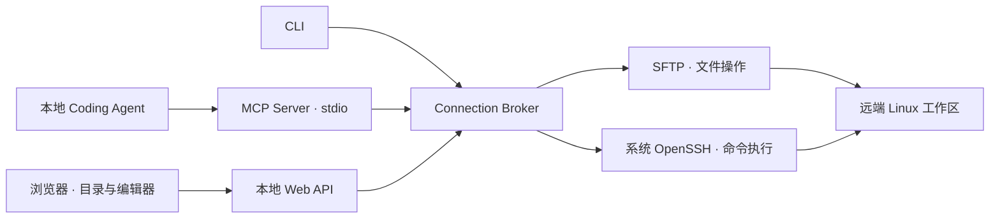

# BIC-Server-Harness

**让本地 Coding Agent 通过 MCP 操作远程 Linux 工作区，同时提供一个可视文件浏览器。**

适合偶尔查看、编辑服务器文件和执行命令的个人使用场景。主要面向 Windows，
也支持 macOS/Linux。远端只需已有的 SSH、SFTP 和 shell，无需安装 Node.js、
Python 包或 Agent 服务，适合难以部署现代远程开发环境的旧服务器。

Agent 在本地思考和规划；只有实际的远端操作才访问服务器。

[基本功能](#基本功能) · [实现方式](#实现方式) · [Windows 安装](#windows-安装) · [注册 MCP](#注册-mcp) · [文件浏览器](#文件浏览器)

## 基本功能

- **浏览和编辑文件**：懒加载目录树、文本查看与编辑、新建、重命名、移动和删除。
- **供 Agent 使用的文件工具**：列目录、读取元数据、分段读取、文本写入和文件哈希；二进制可用 Base64 读取。
- **执行远端命令**：返回 stdout、stderr 和退出码；长命令支持异步任务、增量输出、查询和取消。
- **共享连接**：MCP、CLI 和文件界面共用同一 profile 的 Broker，文件操作复用 SFTP 连接。
- **基本文件保护**：限定文件工作区、检查符号链接越界，支持保存前的修改冲突检查。

MCP 提供 14 个工具：

| 用途 | 工具 |
| --- | --- |
| 查看文件 | `list_dir`、`stat`、`read_file`、`hash_file` |
| 修改文件 | `write_file`、`mkdir`、`move`、`delete` |
| 执行命令 | `exec`、`exec_start`、`exec_status`、`exec_cancel` |
| 连接管理 | `connection_status`、`reconnect` |

MCP 是 Agent 的工具接口；人使用的目录树与编辑器由 Web Explorer 提供。
Windows 使用浏览器作为文件界面，目前没有独立的 Windows Desktop 安装包。

## 实现方式



所有桥接组件都在本地运行，远端沿用标准 SSH 服务。Broker 按 profile 管理连接，
文件操作语义集中在 `sshbridge/ops.py`。认证复用 OpenSSH 的配置、密钥、SSH Agent、
`ProxyJump` 和 known hosts。

### 连接如何保持

- 目录浏览和文件读写使用同一个顺序 SFTP 长连接。
- macOS/Linux 在支持时通过 ControlMaster 复用 SSH TCP 连接。
- **Windows 当前不启用 ControlMaster，每条 Exec 命令会新建 SSH 连接**，并保持单并发和连接频率限制。
- 连接失败后进入暂停状态，普通请求不会反复重连；恢复需要显式操作。
- 异步任务的状态轮询访问本地 Broker，不会每次重新建立 SSH 连接。

若服务器限制连接频率，优先让 Agent 使用文件工具查看目录和内容，减少用 `exec`
反复运行 `ls`、`cat`。SSH 保活有助于维持空闲连接，但不能保证永不断线；连接频率
限制也需要符合目标服务器的规则。

## Windows 安装

### 1. 准备本地环境

需要 Git、Python 3.12 和 Windows OpenSSH 客户端。先确认：

```powershell
git --version
py -3.12 --version
ssh -V
```

使用普通 SSH 确认能够登录目标服务器，并确认主机身份。后续自动调用使用密钥或
SSH Agent，默认不弹出密码输入。

### 2. 获取代码和依赖

```powershell
git clone https://github.com/HIT0638/bic-server-harness.git
cd bic-server-harness
py -3.12 -m venv .venv/mcp
.venv/mcp/Scripts/python.exe -m pip install -r requirements-mcp.txt
if (!(Test-Path bridge.json)) { Copy-Item bridge.example.json bridge.json }
```

当前从源码运行，无需制作安装包。MCP 依赖位于独立环境，基础 CLI、Broker 和 Web
不依赖第三方 Python 包。

### 3. 配置工作区

编辑本地 `bridge.json`。下面是一个 Windows 配置示例：

```json
{
  "default_profile": "my-server",
  "profiles": {
    "my-server": {
      "host": "my-ssh-host",
      "port": 22,
      "user": "my-user",
      "root": "/home/my-user/project",
      "strict_host_key": "yes",
      "connection_policy": {
        "mode": "broker",
        "control_master": false,
        "min_connect_interval": 10
      },
      "ssh_args": [
        "-o", "ServerAliveInterval=60",
        "-o", "ServerAliveCountMax=5"
      ]
    }
  }
}
```

替换 `host`、`user`、`port` 和 `root`。`host` 可使用 SSH config 中的别名，但这里的
`user` 和 `port` 仍需正确填写，它们会覆盖 SSH config 的对应值。

`root` 必须是已存在的远端绝对目录，不能为 `/`。工具中的 `/` 映射到这个目录，
不是服务器的系统根目录。`min_connect_interval` 的单位为秒，用于限制额外 SSH
连接尝试；过于密集的请求会被拒绝，不会自动等候后重试。

`bridge.json` 已被 Git 忽略。更多字段见 [配置示例](bridge.example.json)。

### 4. 启动 Broker

在独立 PowerShell 窗口运行：

```powershell
.venv/mcp/Scripts/python.exe remote.py --config bridge.json broker start
.venv/mcp/Scripts/python.exe remote.py --config bridge.json ls /
```

某些终端或 MCP Host 使用 Windows Job Object 限制后台进程。若启动提示无法创建
独立 Broker，在独立窗口以前台方式运行并保持该窗口打开：

```powershell
.venv/mcp/Scripts/python.exe -m sshbridge.broker --serve --config "$PWD/bridge.json"
```

Broker 可被多个客户端共享。关闭 MCP 或文件界面不会主动停止它。

## 注册 MCP

以下为支持 `mcpServers` JSON 配置的客户端示例。将路径替换为实际仓库位置；
不同 Agent 客户端的配置文件位置和格式以其自身说明为准。

```json
{
  "mcpServers": {
    "sshbridge": {
      "command": "C:/projects/bic-server-harness/.venv/mcp/Scripts/python.exe",
      "args": [
        "-m", "sshbridge.mcp_server",
        "--config", "C:/projects/bic-server-harness/bridge.json",
        "--profile", "my-server"
      ],
      "env": {
        "PYTHONPATH": "C:/projects/bic-server-harness"
      }
    }
  }
}
```

选择 **stdio / 本地命令** 类型，不需要配置 HTTP 地址。Python 和配置文件使用绝对
路径，`PYTHONPATH` 指向仓库根目录。`--profile` 的名称必须与 `bridge.json` 中的
配置一致；若仍使用示例中的 `legacy-linux`，这里也填写 `legacy-linux`。
一个 MCP Server 进程对应一个 profile。

重新加载客户端后，应能看到上面的 14 个工具。可以先让 Agent 列出工作区根目录，
再读取一个小文件。MCP 注册本身不需要重新打包项目。

## 文件浏览器

在仓库根目录另开终端：

```powershell
.venv/mcp/Scripts/python.exe remote.py --config bridge.json serve
```

默认打开带随机访问 token 的 `127.0.0.1:8765` 页面。目录按需展开，支持 UTF-8
文本编辑、创建和重命名、删除文件或空目录；二进制与过大的文件只显示元数据。
保存时检查文件修改时间与大小。

端口被占用时，可以使用随机端口：

```powershell
.venv/mcp/Scripts/python.exe remote.py --config bridge.json serve --port 0
```

## 手动操作与连接恢复

以下命令均在仓库根目录运行。使用多个工作区时增加 `--profile NAME`。

```powershell
.venv/mcp/Scripts/python.exe remote.py --config bridge.json read /README.md
.venv/mcp/Scripts/python.exe remote.py --config bridge.json exec --cwd / -- uname -a
.venv/mcp/Scripts/python.exe remote.py --config bridge.json broker status
.venv/mcp/Scripts/python.exe remote.py --config bridge.json broker reconnect
```

遇到 `CONNECTION_PAUSED`，先检查网络和 SSH 登录，再显式重连；遇到
`CONNECTION_RATE_LIMITED`，等待提示的间隔后再操作。需要停止共享 Broker 时使用
`broker stop`，它会影响正在使用同一 profile 的客户端。

## macOS / Linux

使用 Python 3.12 创建环境，安装同一套 MCP 依赖：

```sh
git clone https://github.com/HIT0638/bic-server-harness.git
cd bic-server-harness
python3.12 -m venv .venv/mcp
.venv/mcp/bin/python -m pip install -r requirements-mcp.txt
[ -f bridge.json ] || cp bridge.example.json bridge.json
# 编辑 bridge.json 后运行
.venv/mcp/bin/python remote.py --config bridge.json serve
```

MCP 注册方式相同，将 `command` 改为 `.venv/mcp/bin/python` 的绝对路径，同时替换
配置文件和 `PYTHONPATH`。macOS/Linux 支持时可启用示例中的 ControlMaster。

仓库还保留可选的 macOS Desktop 和 CLI/Broker Rsync 能力。Windows 当前不提供
Rsync；日常使用 MCP 和文件浏览器无需安装这些可选组件。

## 使用边界与开发

文件操作检查工作区和符号链接边界；写入先使用同目录临时文件，再重命名。服务端不支持
`posix-rename@openssh.com` 时，覆盖回退不保证原子性。

`exec` 可以执行任意 shell 命令，`cwd` 仅是起始目录，不是命令沙箱。超时或取消只终止
本地 SSH channel，远端进程可能继续运行。异步任务保存在 Broker 内存中，重启后不保留。
哈希工具与 SHA-256 写入检查额外依赖远端 `sha256sum`，普通文件操作不依赖它。

测试采用临时配置、密钥和工作区。Windows 云端测试范围与复现方法见
[Windows 自动测试](docs/windows-testing.md)，维护背景见 [AGENTS.md](AGENTS.md)，
设计记录见 [draft.docs](draft.docs/README.md)。测试通过的环境不代表所有旧服务器
均已验证，首次使用建议选择一个可丢弃的工作目录。
