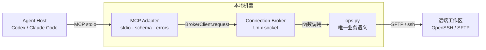

# MCP Server

## 状态

stdio MCP MVP 已实现。

- Runtime：`c7d8330`（`feat: add stdio mcp server`）
- Tests：`61c2f9f`（`test: verify mcp broker integration`）
- Config guard：`ef528b3`（`fix: enforce mcp broker configuration`）

## 背景

CLI 和 Web Explorer 已经通过 `sshbridge/ops.py` 提供统一的远程文件操作。下一阶段
需要让 Codex、Claude Code 等本地 Coding Agent 通过 MCP 直接调用相同能力。

MCP Server 运行在本地。远端服务器不安装 MCP 组件，也不运行 Agent Runtime。

## 目标架构



## 当前实现

`sshbridge/mcp_server.py` 使用官方 MCP Python SDK `2.2.0` 注册 11 个 tools。
模块导入时不加载 SDK；只有 `create_mcp_server` 或 CLI 入口运行时才加载可选依赖。
`create_mcp_server` 创建一个 profile-bound `BrokerClient` 并只通过它访问远端：

```python
def create_mcp_server(
        profile,
        config_path,
        mcp_module=None,
        broker_client_factory=BrokerClient):
    sdk = _sdk_namespace(mcp_module)
    client = broker_client_factory(config_path, profile)
    client.ensure_started()
    adapter = _McpBrokerAdapter(
        profile, config_path, client, sdk.ToolError)
```

Broker 已调用该层，CLI、Web 和 Desktop 通过 Broker 间接复用相同语义。旧 daemon
入口只是 Broker 兼容别名。MCP Adapter 通过 `asyncio.to_thread` 调用同步
`BrokerClient.request/status/reconnect`，不直接调用 `ops.py`，也不生成 SSH/SFTP
连接。MCP 进程退出时不会调用 `BrokerClient.stop()`。

## 痛点

- 没有 MCP 时，Agent 只能通过 shell 拼接 CLI 命令。
- CLI 文本参数不适合可靠传递大段内容和结构化错误。
- 每个 Agent 若直接调用 `ops.py`，可能各自创建 SSH 连接。
- MCP 协议可能演进，手写协议增加兼容风险。
- 大文件内容直接进入 MCP 上下文会增加传输和 token 成本。

## 目标

- 暴露与 CLI 等价的 MCP tools。
- 保持 `ops.py` 为唯一业务语义实现。
- MCP 进程不直接拥有 SSH 连接。
- 所有远端请求通过 Connection Broker。
- 保持错误码、读取限制、冲突检测和路径沙箱一致。
- 支持 Codex、Claude Code 等使用 stdio MCP 的本地 Agent。

## 预期

- Agent 可直接列目录、读取、写入、移动文件和执行命令。
- MCP Server 退出不会导致额外远端连接风暴。
- 多个 Agent 进程共享同一个 profile broker。
- Tool 返回结构稳定，可区分业务错误、连接错误和冲突。
- 大文件请求被明确拒绝或要求分页，不会静默截断。

## 方案

### 进程与传输

- `sshbridge/mcp_server.py` 提供 `create_mcp_server` 和 `app_main`。
- 使用官方 MCP Python SDK `2.2.0` 和默认 stdio transport，不监听网络端口。
- SDK 安装在独立 Python 3.12 虚拟环境；基础 CLI/Web/Broker 保持标准库可运行。
- MCP Server 启动时连接本地 Broker；只允许 `connection_policy.mode=broker`。
- 一个 MCP 进程绑定一个 profile，退出时不停止共享 Broker。
- stdout 只传输 MCP 协议，诊断信息只写 stderr。

### Tools

首期暴露：

```text
list_dir(path="/")
stat(path)
read_file(path, offset=0, limit=None, encoding="text")
hash_file(path)
connection_status()
write_file(path, content, expected_mtime, expected_size, expected_hash, force)
mkdir(path, parents)
move(src, dst, force)
delete(path)
exec(command, cwd, timeout)
reconnect()
```

- `read_file` 返回文本或 Base64 二选一，并支持 offset/limit 分页。
- `write_file` 首期只接受 UTF-8 文本，保留版本冲突检测和 `force`。
- `delete` 只删除文件、符号链接或空目录，不允许删除根目录和非空目录。
- `exec` 返回 stdout、stderr、exit_code 和 timed_out。
- `exec` 的 cwd 只是起始目录，不是命令沙箱。
- 单次输入或序列化结果上限为 1 MiB；超过上限返回 `TOO_LARGE`，不静默截断。

### 错误

- `BridgeError` 转换为 SDK `ToolError`，使 Tool Result 的 `isError=true`。
- SDK `2.2.0` 在错误文本前添加 `Error executing tool <name>:`；其后为包含
  `code`、`message` 和 `details` 的单行 canonical JSON。
- `CONFLICT`、`TOO_LARGE`、`SANDBOX_VIOLATION` 不转换为通用内部错误。
- broker 不可用时返回 `BROKER_UNAVAILABLE`，不回退直连。
- 成功与失败结果均移除 `real_path`、`real_cwd`、真实 root、SSH 参数和凭据。

### 配置

Agent 的 MCP 配置使用独立 Python、绝对 config 路径和 profile：

```json
{
  "command": "/absolute/path/.venv/mcp/bin/python",
  "args": [
    "-m",
    "sshbridge.mcp_server",
    "--config",
    "/absolute/path/bridge.json",
    "--profile",
    "default"
  ]
}
```

SSH 密钥、远端 root 和连接策略仍只存在于 bridge 配置和 OpenSSH 配置中。

## 验收标准

- MCP `tools/list` 返回全部 MVP tools 及 JSON Schema。
- 每个 tool 与 CLI 对同一输入产生一致结果和错误码。
- SDK 内存 Client 验证 Schema、annotations、结构化成功结果和 Tool error。
- 两个 MCP 客户端并发运行时只使用一个 broker。
- MCP 进程退出后 broker 可继续服务 CLI/Web。
- 保护模式下 broker 不可用时，不产生 SSH 子进程。
- 使用隔离本地 sshd 完成 MCP 端到端测试。
- stdio stdout 不包含 banner、日志或 traceback。

上述验收项由 `tests/test_mcp_server.py` 和
`tests/test_integration_local_sshd.py` 覆盖。MCP SDK 未安装时，基础 Python 3.9
测试继续执行，SDK 专项测试明确跳过。
