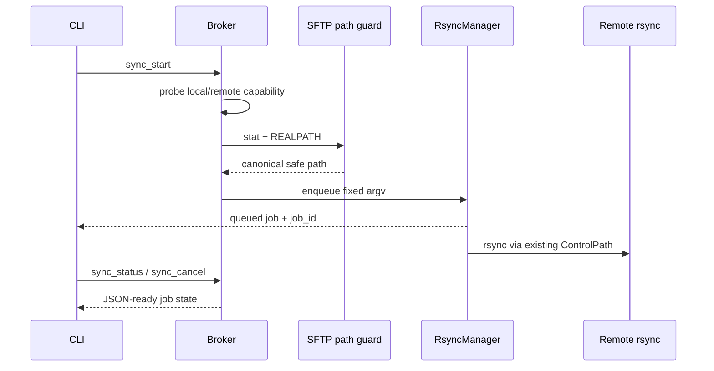

# Rsync 批量传输

## 状态

CLI/Broker MVP 已实现，Web、Desktop 和 MCP 尚未接入。详细实施步骤见
`.trae/documents/rsync-batch-transfer-mvp-implementation-plan.md`。

对应提交：

- `eb0762a`：配置、能力探测和异步任务管理。
- `b34e8dd`：Broker 操作、feature negotiation 和 CLI 命令。
- `5c397f1`：真实 localhost 传输、锁隔离和兼容性验证。

## 背景

SFTP 适合目录浏览、小文件读写和编辑器保存。大文件或大量文件通过逐个 SFTP 请求传输
时，会长时间占用单一 SFTP 队列，并产生较多协议往返。

Rsync 能进行增量、批量和断点友好的文件传输，并可复用系统 OpenSSH。远端是否安装
rsync 不属于当前基础假设，因此该能力只能是可选增强。

## 当前实现

`sshbridge/rsync.py::RsyncManager` 管理能力缓存、固定参数构造、单 worker FIFO
队列、状态查询、取消和有界输出。任务状态只保存在 Broker 内存中，Broker 重启后
旧 job ID 失效。

`sshbridge/broker.py::BrokerState` 暴露 `sync_start`、`sync_status` 和
`sync_cancel`，并在 snapshot 中返回 `features`、任务计数和能力状态。
`sshbridge/cli.py` 提供：

```text
sync push LOCAL [LOCAL ...] --to REMOTE_DIR
sync pull REMOTE --to LOCAL_DIR
sync status JOB_ID
sync cancel JOB_ID
```

远端源和目标先通过现有 SFTP `stat`/`REALPATH` 根目录检查。能力探测和路径检查结束后
释放 Exec semaphore 与 `sftp_lock`，实际 Rsync 进程不占用这些资源。remote shell
由 profile 参数和 Broker ControlPath 构造，其中强制选项放在 profile `ssh_args`
之后，避免调用方覆盖：

```python
ssh_argv = self.profile.ssh_argv() + [
    "-S", self.transport.control_path,
    "-o", "ControlMaster=no",
]
```

能力探测接受 Rsync 帮助中的旧名称 `--protect-args` 或 3.2.6 起使用的现代名称
`--secluded-args`；实际任务固定传兼容别名 `--protect-args`。本地或远端不兼容时
返回 `RSYNC_UNAVAILABLE`，基础 SFTP 和 Exec 继续可用。



## 痛点

- 单个大文件会延迟同一 SFTP 会话上的目录查询。
- 大量小文件逐个上传会产生较多往返。
- 全量覆盖浪费带宽，慢链路下影响明显。
- Rsync 参数复杂，错误拼接可能越过 remote root。
- 本地与远端 rsync 版本可能不兼容。

## 目标

- 为大文件和目录提供独立批量传输通道。
- 不占用 SFTP 操作锁。
- 复用 broker 的 OpenSSH ControlMaster，不新增 TCP 握手。
- 所有源和目标仍受 remote root 约束。
- 本地或远端无兼容 Rsync 时返回明确能力错误，基础 SFTP 功能不受影响。

## 预期

- 大文件传输期间仍可浏览目录和读取小文件。
- 重复同步只传输变化的数据。
- 一次批量任务只占一个受控 Rsync channel。
- 传输状态包含文件数、字节数、退出码和错误摘要。
- 远端路径无法通过参数注入逃离工作区。

## 方案

### 能力发现

- 首次同步前探测本地与远端 Rsync，Broker 生命周期内缓存结果。
- 本地与远端都必须支持 protected args；探测接受帮助中的 `--protect-args` 或
  `--secluded-args`，不能只依赖版本字符串判断。
- 当前 transport 必须存在可用 ControlMaster；降级 transport 不启动 Rsync。
- 能力探测失败不影响基础 SFTP 功能。

### API

Broker 操作：

```text
sync_start(direction, sources, destination)
sync_status(job_id)
sync_cancel(job_id)
```

- `sync_start` 异步返回 job ID。
- push 支持一个或多个显式本地源，目标为已存在远端目录。
- pull 首版支持一个远端文件或目录，目标为已存在本地目录。
- CLI 是首版唯一入口；Web、Desktop 和 MCP 不在本期范围。

### 传输

- 使用系统 `rsync`。
- 通过 Broker 提供的 ControlPath 调用系统 `ssh`，不可复用时失败。
- Rsync 并发固定为 1，等待队列最多 8 个任务。
- 使用 `--partial-dir=.sshbridge-partial` 保留失败或取消后的 partial。
- 使用 `--links --safe-links`，不跟随传输树外部的符号链接。
- 不接受任意 Rsync options，不支持 destructive `--delete`。
- `-e` remote-shell 字符串只由受信任 profile 和 ControlPath 构造；用户路径仅作为
  `--` 后的独立 operand。
- 远端源和目标在启动任务前经 SFTP `REALPATH` 与 canonical root 校验。

### 回退

- MVP 不自动回退 SFTP，结果固定标记 `transport=rsync`。
- 缺少 executable、protected args 或 ControlMaster 时返回稳定能力错误。
- 显式 SFTP fallback 作为后续独立设计，避免静默阻塞交互 SFTP channel。

## 验收标准

- Rsync 任务运行时 `list_dir` 延迟不受 SFTP 锁阻塞。
- 传输使用现有 ControlMaster，不增加 SSH TCP。
- 所有远端源和目标通过 canonical root 校验。
- 路径和 executable 参数无法通过 shell metacharacter 注入。
- push、pull、status 和 cancel 返回稳定 JSON-ready 结果。
- 单并发、队列、输出缓存和任务历史均有固定上限。
- 无 rsync 的测试主机仍可使用全部基础文件操作。
- 取消不得错误宣称远端进程已确认终止。

## 验收结果

- `tests/test_rsync.py` 覆盖固定 argv、特殊路径、能力缓存、单 worker、队列上限、
  queued/running 取消、输出上限、历史清理和 transport failure。
- `tests/test_broker_config.py` 覆盖 feature negotiation、Broker 路由、reconnect
  缓存失效，以及长任务运行时 SFTP 和 Exec 仍可继续。
- `tests/test_integration_local_sshd.py` 使用隔离 localhost OpenSSH 验证真实
  push/pull、CLI status、canonical symlink 越界拒绝、旧远端 Rsync 不影响 SFTP，
  且一次 Broker 生命周期内 `tcp_generation` 保持为 1。
- 实传期间的 `lsof` 验证显示传输前和传输中均只有 1 条客户端 SSH TCP；取消后的
  job 为 `cancelled` 且 `remote_termination_unknown=true`。
- Python 3.9 与 3.12 均通过 108 项全量测试和编译检查；arm64 macOS App 构建及
  `codesign --verify --deep --strict` 通过，bundle 包含 `sshbridge/rsync.py`。

## 已知限制

- 只提供 CLI/Broker 接口，没有 Web、Desktop 或 MCP 入口。
- 任务历史不持久化，Broker 重启后 job ID 失效。
- pull 只接受一个远端源；push 目标和 pull 目标必须是已存在目录。
- running 取消只能确认本地进程组已终止，不能证明远端进程已经退出。
- Rsync 3.2.6 及以上帮助文本通常只显示 `--secluded-args`，实现依赖其保留的
  `--protect-args` 兼容别名。
