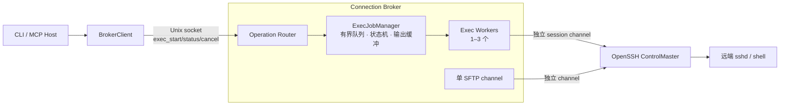
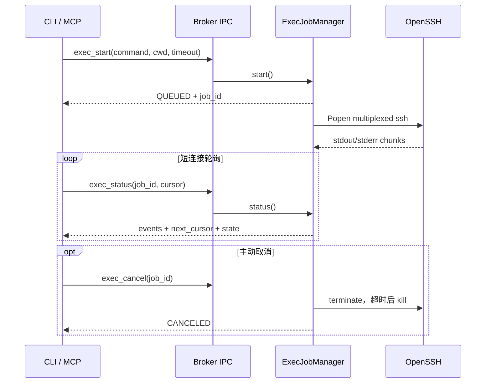
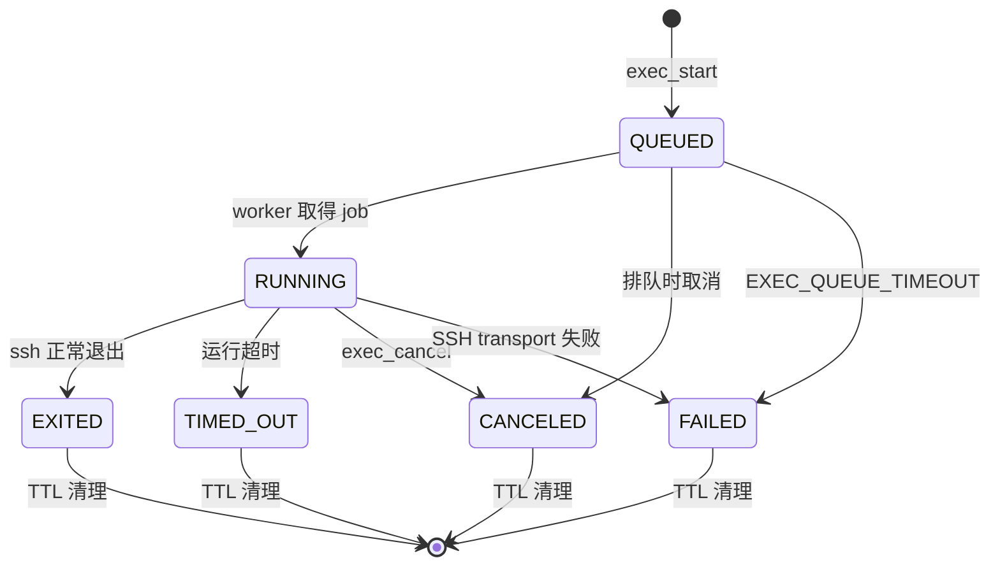

# 长命令执行

## 状态

异步 Exec job MVP 已实现。

- 设计与实施计划：
  `.trae/documents/long-running-commands-mvp-implementation-plan.md`
- 核心实现：`5324f69`
- CLI 与 MCP：`a40cc30`
- 测试：`5dedd6f`

## 背景

构建、测试、日志分析和数据处理可能持续数分钟。同步 `exec` 会占用调用方连接，并在
命令结束后一次性返回结果，无法增量读取输出或主动取消。

OpenSSH ControlMaster 可让多个本地 `ssh` 子进程通过同一 TCP transport 使用独立
session channel。Broker 因此可以在不安装远端 helper 的前提下管理长命令。

## 当前实现

`sshbridge/exec_jobs.py::ExecJobManager` 独占管理：

- 有界等待队列和 1 至 3 个 worker。
- 本地 OpenSSH 子进程生命周期。
- `QUEUED`、`RUNNING`、`EXITED`、`TIMED_OUT`、`CANCELED`、`FAILED`
  状态机。
- stdout/stderr 独立 reader 与统一单调 cursor。
- 每个 job 的有界内存输出、终态 TTL 和 registry 上限。
- 同步与异步 Exec 的统一并发治理。

当前对外方法为：

```python
class ExecJobManager:
    def start(self, normalized_request): ...
    def status(self, job_id, cursor=0, max_bytes=65536): ...
    def cancel(self, job_id): ...
    def run_sync(self, profile, command, cwd, timeout): ...
    def snapshot(self): ...
    def close(self): ...
```

Broker 提供：

```text
exec_start(command, cwd="/", timeout=None)
exec_status(job_id, cursor=0, max_bytes=65536)
exec_cancel(job_id)
```

CLI 提供：

```text
remote exec-start [--cwd PATH] [--timeout SEC] -- COMMAND...
remote exec-status JOB_ID [--cursor N] [--max-bytes N]
remote exec-cancel JOB_ID
```

MCP 同名提供三个 tools。Broker protocol 保持 v1，并通过
`exec_jobs_v1` capability 区分旧 Broker；客户端发现旧实例时返回
`BROKER_RESTART_REQUIRED`，不会自动停止共享 Broker。

### 架构



### 调用时序



### 状态机



## 资源边界

默认配置：

```json
{
  "exec_concurrency": 2,
  "exec_queue_limit": 8,
  "exec_queue_timeout": 60,
  "exec_output_limit_bytes": 4194304,
  "exec_job_ttl": 600,
  "exec_max_jobs": 32
}
```

- 单次 status 最多返回 64 KiB 原始文本。
- reader 每次最多读取 32 KiB。
- 输出超过单 job 上限时淘汰最早内容，并返回
  `output_truncated=true` 和 `truncated_before=true`。
- job 只保存在 Broker 内存中，Broker 重启后不可恢复。
- ControlMaster 首次 READY 前有效并发为 1，成功后提升到配置值。
- 无 ControlMaster 时保持单并发，新连接继续受最小建连间隔限制。

## 安全边界

`cwd` 只是远端命令的起始目录，不是命令沙箱。命令可以访问远端账户有权访问的其他
路径。

取消排队 job 可保证命令未启动。取消或超时运行中 job 只终止本地 OpenSSH process
和 channel；没有远端 PID 或 process group helper，因此返回
`remote_termination_unknown=true`，远端进程可能继续运行。

状态结果不回显完整命令、真实远端 root、SSH argv 或本地进程信息。job 输出不写入
Broker 日志。

## 验证

- 单元测试覆盖队列容量与超时、状态迁移、取消、运行超时、输出淘汰、cursor 分页、
  transport failure、TTL、关闭清理和同步兼容。
- 一次性本地 OpenSSH 测试覆盖增量输出、双并发与第三项排队、SFTP 独立响应、
  queued/running cancel、timeout、CLI 轮询及单 TCP 复用。
- Python 3.12 MCP 测试覆盖 14 个 tool 的 schema、annotations、Broker 参数映射、
  stdio 调用和跨 MCP Client 查询同一个 job。

## 已知限制

- job 不跨 Broker 重启持久化。
- 不提供 stdout/stderr 推送，只支持短连接轮询。
- 不保证远端进程在取消或超时后终止。
- Web Explorer 和 macOS Desktop 暂无终端界面。
- Windows named pipe Broker 尚未实现。
